# lattice-oidc

## Security fixes compared to the reference server

- JWT bearer and token exchange: the reference never checked the signature on JWT bearer assertions or JWT subject tokens, so a forged JWT got tokens. These are now verified against this server's own Authlete keys or a configured list of trusted issuers; anything else is rejected.
- Pairwise `sub`: computed as a keyed hash per site, so it's opaque and can't be linked across clients. The reference concatenated the sector and the user ID in plain text.
- ACR: an `acr` is only asserted if it's configured as satisfied by password login. The reference echoed back whatever the client asked for.
- Login: passwords are hashed with Argon2 and accounts lock after repeated failures. Response timing doesn't reveal which accounts exist.
- Sessions: a new session ID on every login, server-side invalidation on logout, and pending flows only completable by the browser that started them.
- Browser forms: protected against cross-site form posts (CSRF), with security headers and a CSP set throughout.

### Pairwise sub: a keyed hash instead of plain concatenation

**What pairwise means** (OIDC Core §8.1). A client registered with `subject_type=pairwise` should get a different `sub` for the same user than every other client, so that two sites can't compare notes and work out that they share a user.

The reference built `sub` as `"PAIRWISE-" + sectorIdentifier + "-" + userId`, for example `PAIRWISE-shop.example-1001`. The real user ID sits inside the string, so any two clients can strip the prefix and correlate users. It also leaks the internal user ID.

Lattice computes it in `PairwiseSubjects`:

```text
sub = base64url(HMAC-SHA256(secret, sector + "|" + userId))
```

- Stable: the same user on the same site always gets the same value.
- Unlinkable: different sites get unrelated values.
- Not reversible without the server's secret (`PAIRWISE_SECRET`, falling back to the app secret).

### JWT bearer and token exchange: signatures are now verified

Normally a user logs in at this server through the browser. These two grants let an application get a token for a user without that browser login, by showing proof that someone else has already vouched for the user.

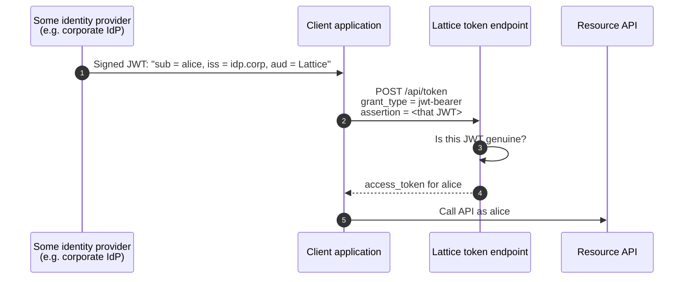

- **JWT bearer (RFC 7523)**: the proof is a JWT signed by someone (the `assertion`).
- **Token exchange (RFC 8693)**: the proof is a token the client already holds (the `subject_token`). It can be an access token, a refresh token, a JWT or an ID token.

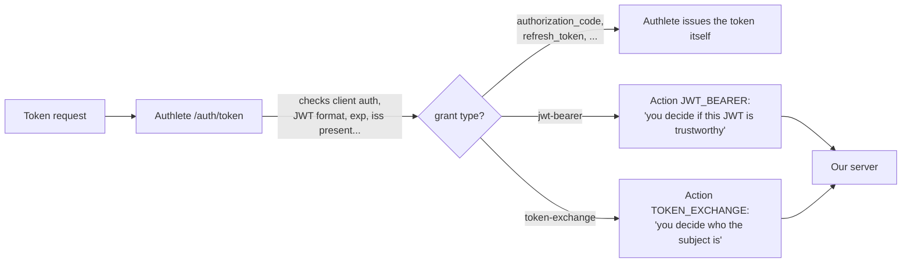

Authlete can't verify the signature because it doesn't know which keys to trust. The JWT could be signed by any identity provider in the world, and only the deployment knows which of them it trusts. So the authorization server has to do this check itself.

#### The bug in the reference server

The reference server's `verifySignature()` method was empty, so it trusted whatever the JWT claimed:

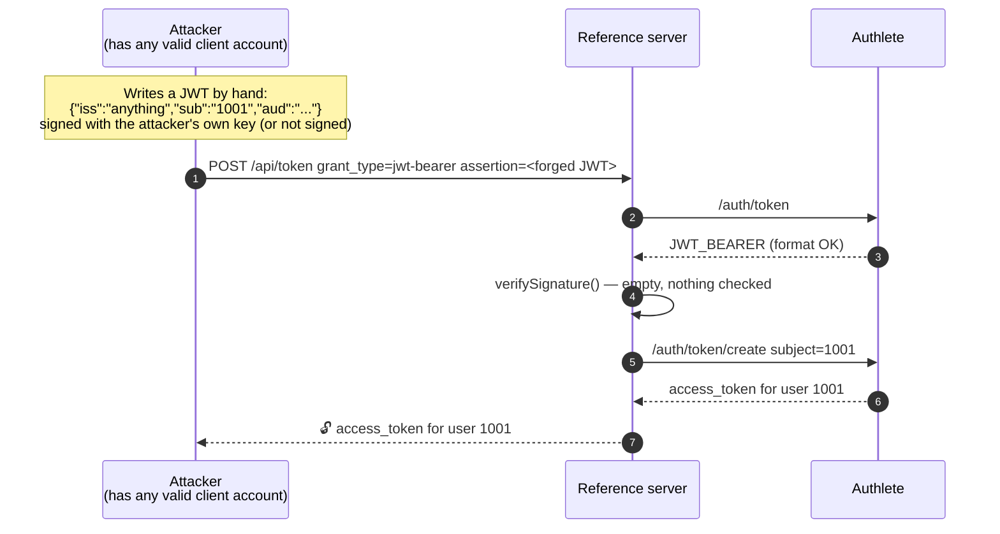

Anyone with any client registration could get tokens for any user, without ever knowing that user's password. That's full account impersonation. Token exchange had the same problem with JWT and ID-token subject tokens.

#### What Lattice checks now

`TokenGrantHandler` hands the JWT to `JwtVerifier`, which only lets it through if every check below passes:

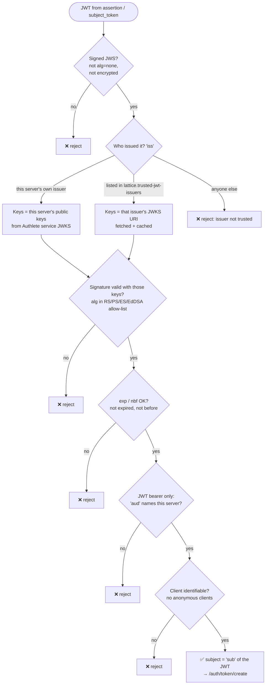

All rejections come back to the client as `400 invalid_grant` (or `invalid_request`), and no token is created.

#### What each check stops

| Check                                            | Attack it stops                                                                              |
| ------------------------------------------------ | -------------------------------------------------------------------------------------------- |
| Must be signed, not `alg=none`, not encrypted    | "Unsigned" JWTs that anyone can write                                                        |
| Issuer must be this server or explicitly trusted | An attacker signing with their own key and naming themselves as issuer                       |
| Signature verified with that issuer's real keys  | Forging a JWT that claims to come from a trusted issuer                                      |
| Algorithm allow-list                             | Algorithm-confusion tricks, such as switching to HMAC and using the public key as the secret |
| `exp` / `nbf`                                    | Reusing an old, leaked JWT indefinitely                                                      |
| `aud` must be this server (JWT bearer)           | Replay: a genuine JWT that the IdP issued for another service, reused here                   |
| Client must be identifiable                      | Anonymous callers using the grant at all                                                     |

#### Legitimate and forged assertions side by side

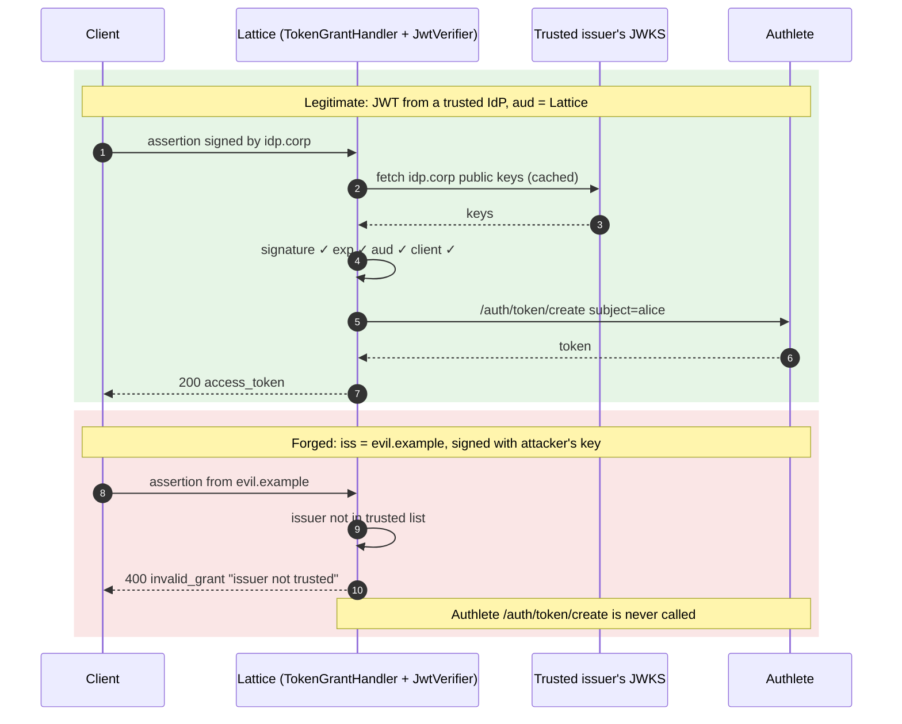

### Login: Argon2 hashing, lockout, and no account enumeration

- Argon2 hashing, a memory-hard algorithm that makes offline cracking expensive. Demo passwords are hashed when the store loads; nothing is stored in plain text.
- Lockout: after `lattice.login.max-failures` wrong passwords (default 5), that login ID is locked for `lattice.login.lockout` (15 minutes). While it's locked, even the correct password is refused, so an attacker can't keep guessing. The user sees "Too many failed attempts".

### Sessions: rotation, real logout, and pending flows tied to one browser

**Session ID rotation** (`UserSessions.login`). Every successful login creates a brand-new session ID (`session_id` in the cookie). This prevents session fixation, where an attacker plants a known session ID in the victim's browser before they log in and then rides on it afterwards.

**Server-side invalidation.** Play's session cookie is signed, but anyone holding a copy can replay it. So the cookie only carries the session ID, and a session counts as valid only while that session ID is registered on the server. Logout removes it there, so a stolen or replayed copy of the old cookie stops working. A test checks this. The session ID is also what back-channel logout and native SSO key on, and it is sent to clients as the `sid` claim of ID tokens and logout tokens.

**Pending flows bound to the browser** (`Interactions`). Each browser gets a stable random ID (`browser_id`) in its cookie. Pending consent, device-approval and federation-login state is stored server-side under its ticket or code and tagged with that `browser_id`. Completing a flow requires the same `browser_id`. That stops an attacker who learns or guesses a ticket from completing the consent or device approval from their own browser, and it stops cross-site requests from finishing someone else's flow. CSRF tokens on the forms add a second layer.

**Single use.** The ticket is removed when it's used, so a replayed decision fails. That's tested too.

## Project structure

```text
com.lattice.oidc
├── controllers/   thin Play controllers, one per spec area; routes point here
│                  BaseController, Authorization, Token, UserInfo, Introspection,
│                  Revocation, Par, ClientRegistration, GrantManagement, Discovery, Ciba,
│                  Device, Credential, CredentialOffer, Federation (OpenID Federation 1.0),
│                  IdentityBroker, Obb, Logout, Health, Test
├── handlers/      protocol logic: AuthorizationHandler, TokenGrantHandler (exchange/JWT bearer),
│                  NativeSsoHandler, CibaHandler, DeviceHandler, CredentialOrderHandler,
│                  ObbDcrHandler, ObbTokenHandler, LogoutHandler,
│                  IdentityProvider, IdentityProviders (identity brokering)
├── models/        AuthorizationPage, AuthorizationInteraction, Consent, User, IdentityProviderConfig, ...
├── security/      LoginService, UserSessions, Interactions, JwtVerifier, PairwiseSubjects,
│                  ObbCertValidator, AuditService
├── stores/        UserStore, InMemoryUserStore, ConsentStore
├── client/        Authlete Play WS client, ServerMetadata
├── filters/       RequestIdFilter, HstsFilter, AccessLogFilter
├── common/        Requests, Responses, Jsons, WebException, ErrorHandler, Redaction, LatticeConfig
└── modules/       AuthleteModule
```

## Design and screens

Designs for all 15 end-user and operator screens (sign-in, consent, device flow, CIBA, logout, account, wallets, open banking and the operator console) are in [docs/screens](docs/screens/README.md), with the design language, the flow each screen belongs to, and whether it is built yet.

## Running the server in production

```sh
sbt --client stage
APPLICATION_SECRET=$(openssl rand -hex 32) \
AUTHLETE_SERVICE_APIKEY=<id> AUTHLETE_SERVICE_ACCESSTOKEN=<token> \
target/universal/stage/bin/lattice-oidc -Dhttp.port=9000
```

## Tickets: a handle for pending requests

A ticket is Authlete's handle for a request it is in the middle of processing. When Authlete can't finish a request on its own (for example, it needs the user to log in and consent), it remembers the parsed request on its side and gives Lattice an opaque string, the ticket. Lattice later sends that ticket back to finish the request (issue) or reject it (fail).

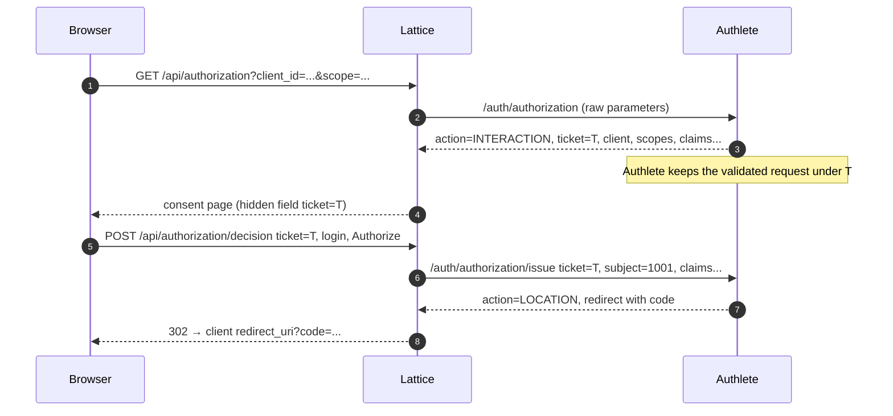

## Single sign-on

Once a browser has a login session at Lattice, other applications can reuse it without asking for the password again.

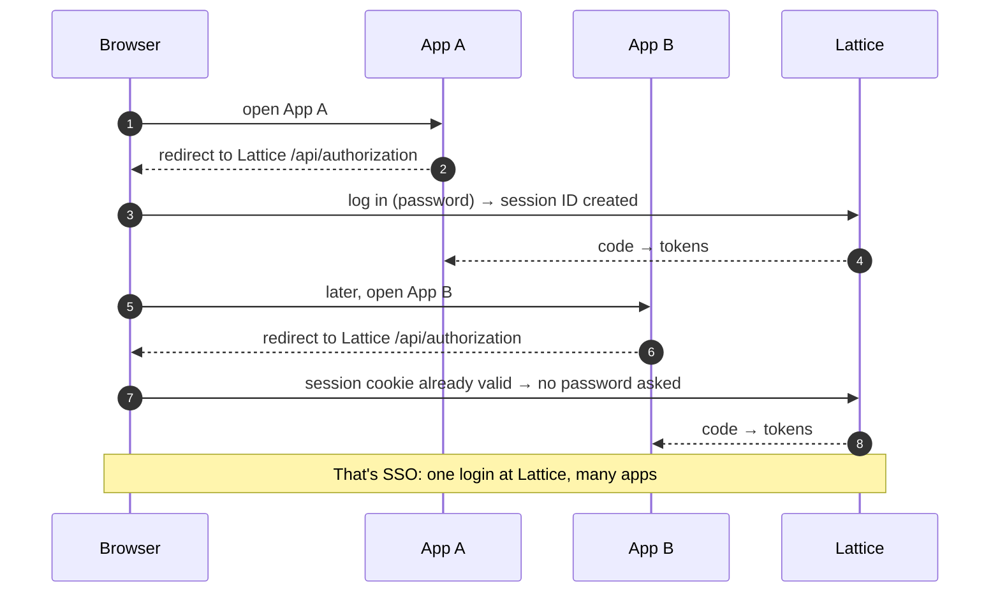

## Identity brokering

Identity brokering lets users sign in to Lattice with an existing account at an external identity provider such as Okta, Azure AD or Google. Lattice delegates authentication to that provider, verifies the result, and maps the external identity to a local account (for example `alice@okta`) with its own Lattice session. Keycloak calls this feature Identity Brokering; it is also known as social login or upstream identity providers.

### `IdentityProvider`: one upstream provider

Code: `handlers/IdentityProvider.java` (Keycloak: `OIDCIdentityProvider`).

Each instance is the relying-party client for a single OpenID Provider (one entry in the identity providers file, for example `"okta"`). It does the actual protocol work with that provider:

- **Discovery**: fetches and caches the provider's `/.well-known/openid-configuration` and checks that `issuer` matches.
- `authenticationRequest(state, verifier, nonce)`: builds the redirect URL to the provider's authorization endpoint, using the code flow with PKCE, `state` and `nonce`.
- `complete(callbackUrl, state, verifier, nonce)`:
  1. Parses the callback and checks `state`.
  2. Exchanges the code at the provider's token endpoint.
  3. Validates the ID token (signature from the provider's JWKS, issuer, audience, nonce).
  4. Calls UserInfo and checks that its `sub` matches the ID token's.

### `IdentityProviders`: the registry

Code: `handlers/IdentityProviders.java`. A `@Singleton` that holds every configured provider:

- At startup: reads the JSON file named by `lattice.identity-providers.file` (`IDENTITY_PROVIDERS_FILE`; `FEDERATIONS_FILE` is still accepted), skips incomplete entries with a warning, and creates one `IdentityProvider` per valid entry. The file has a top-level `identityProviders` array; entries use the format of java-oauth-server's `federations.json`, and its top-level `federations` key is still accepted.
- A ready-made example with Okta, Microsoft, Google, Keycloak and PingFederate entries is in `conf/identity-providers.example.json`. Copy it, fill in your values, and point `IDENTITY_PROVIDERS_FILE` at it. Each `redirectUri` must be `<base URL>/api/federation/callback/<id>` and registered at the provider.
- `get(id)`: looks up the `IdentityProvider` for an ID such as "okta". `IdentityBrokerController` uses it in `/api/federation/initiation/:id` and `/api/federation/callback/:id`.
- `links()`: returns (id, name) pairs so the consent page can show "Or sign in with: Okta, …".

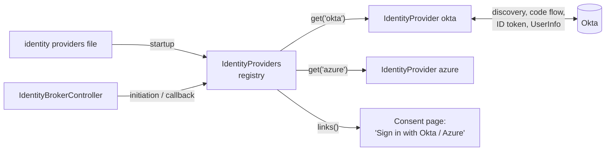

### The flow at a glance

Lattice is the client here, and an external provider (Okta, Azure AD, Google…) authenticates the user.

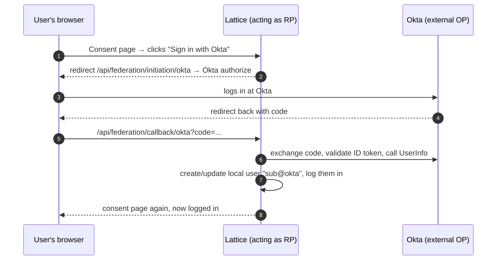

### The flow in detail

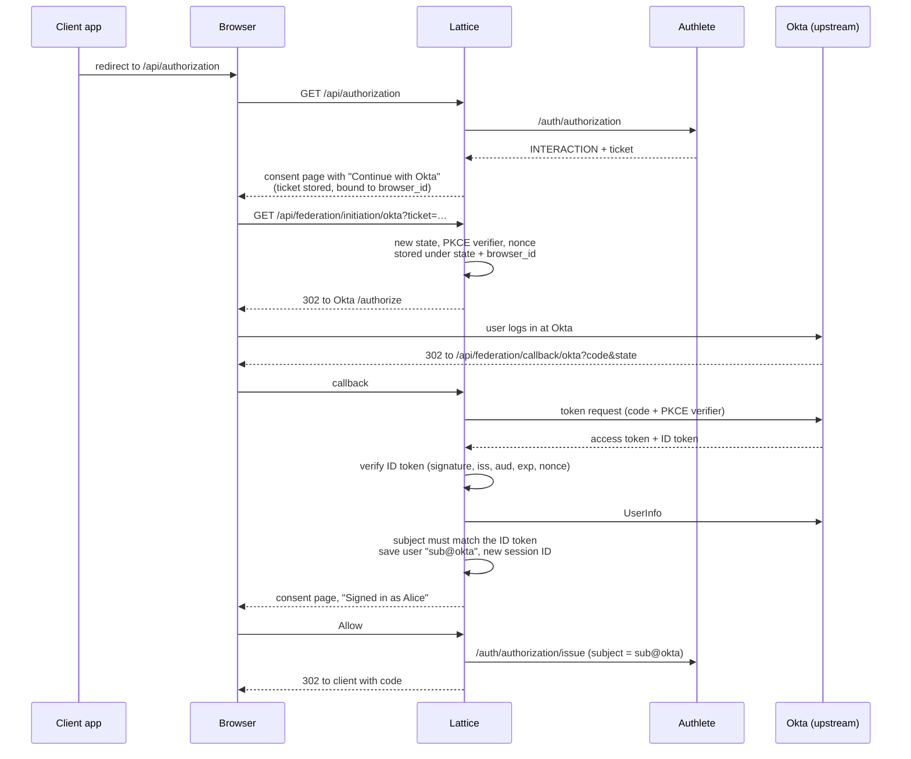

### Summary

- **Question it answers**: "Who is this user?" Another provider vouches for them.
- **Direction**: Lattice is the client of Okta. It has a client_id and secret at Okta.
- **Code**: `IdentityProvider`, `IdentityProviders`, and `IdentityBrokerController` (`initiation`, `callback`).
- **Configured in**: the identity providers file (`lattice.identity-providers.file`).
- **Spec**: plain OpenID Connect, with Lattice on the client side.

## OpenID Federation 1.0

OpenID Federation 1.0 is a trust framework that lets client applications and providers trust each other through a shared authority, so clients don't need to be registered manually. It is what `/.well-known/openid-federation` and `/api/federation/register` implement. Lattice is the provider here: instead of every client being registered in advance, a shared trust anchor (for example a national open-banking directory) vouches for both the provider and its clients, and trust is checked by following a chain of signed statements.

### Why it exists

In plain OpenID Connect, trust is set up one pair at a time. Before a relying party (RP, the client app) can use an OpenID Provider (OP), the two have to know each other:

| Approach                               | How the RP gets known to the OP                  | What's still missing                                                                                                           |
| -------------------------------------- | ------------------------------------------------ | ------------------------------------------------------------------------------------------------------------------------------ |
| Static registration                    | An admin registers the client by hand at each OP | Doesn't scale: 1,000 RPs × 50 OPs means 50,000 manual registrations                                                            |
| Dynamic Client Registration (RFC 7591) | The RP registers itself through an API           | It solves the mechanics, not trust: the OP still can't tell whether the client is a real, approved organisation or an attacker |

Large ecosystems hit this immediately: national eID schemes (Italy's SPID/CIE run on OpenID Federation), university networks, open banking, health networks and EU digital identity wallets. Thousands of parties that have never met still need to trust each other automatically.

**OpenID Federation's answer is to make trust hierarchical, the way TLS certificates work.** A single authority (the Trust Anchor) vouches for a set of intermediates, which in turn vouch for the relying parties and providers. The relying party can verify the chain of trust up to the anchor, and the provider can do the same. That way, a relying party can be registered automatically without any prior relationship with the provider.

Trust Anchors vouch for intermediates, intermediates vouch for the actual OPs and RPs, and each of these "vouches" is a signed JWT. Two parties that have never met can each follow a chain of these JWTs up to a Trust Anchor they both trust. If both chains reach it, they trust each other, with no prior registration.

### Where it's used

Real ecosystems hit that scale whenever many relying parties each have to accept many identity providers, usually because the user picks their own provider from a list. Every RP then needs a working relationship with every OP. Here are the real-world cases.

#### National digital identity: the best-known case

Italy's SPID is the textbook example, and it's one of the first large deployments of OpenID Federation.

- Citizens get their digital identity from one of about a dozen accredited private identity providers (Poste, Aruba, InfoCert and others).
- Thousands of relying parties (municipalities, ministries, tax and health services, universities, plus private companies) all show a "Sign in with SPID" button listing every provider.
- That's thousands × about a dozen pairwise relationships, all of which must carry correct keys and metadata, stay current through key rotation, and be cut off immediately when a party is suspended.

The real burden isn't the first registration but keeping all those pairs correct afterwards. That's the problem a Trust Anchor solves: a service joins once, and every provider trusts it automatically.

#### Research and education

Universities worldwide run identity providers, and services such as journal publishers, research tools, eduroam and cloud computing grants want to accept users from any university. National federations (InCommon, the UK federation, DFN and others) and eduGAIN, which links them, are the trust frameworks that make this work. They mostly run on SAML metadata today, and OpenID Federation 1.0 is designed partly as the OIDC counterpart of that model.

#### Open banking and open finance

Every bank (acting as the OP for its customers) must accept every licensed third-party provider (budgeting apps, payment initiators), and every provider wants to connect to every bank.

Brazil's Open Finance has hundreds of participating institutions, any of which may need to connect to any other.

This is already in Lattice. `ObbDcrHandler` handles the open banking solution to this exact problem. A central directory signs a software statement for every licensed provider, and banks trust the directory instead of each provider. That's a one-level version of federation: the directory plays the Trust Anchor and the software statement plays the Subordinate Statement. OpenID Federation generalises it with intermediates, metadata policies and trust marks.

#### Digital identity wallets (EU and others)

- Millions of wallets, many credential issuers (governments, universities, banks, employers) and very many verifiers (any shop, rental company or website checking an ID or diploma).
- A verifier needs to know whether an issuer is legitimate, and a wallet needs to know whether the verifier asking for your passport data is allowed to ask.
- This is the newest and biggest use case. OpenID Federation is one of the trust frameworks being used or considered with OID4VCI and OID4VP.

#### Health care

Hospitals, labs, insurers and patient apps across a region or country need to trust each other's systems for patient login and data exchange. Many independent organisations, each acting as both provider and consumer, again produce the many-to-many shape.

#### What decides whether you need it

The deciding factor isn't raw numbers. It's whether there's an ecosystem with a governing authority (a government, a banking regulator, a research network) that sets the rules and decides who's in. That authority becomes the Trust Anchor. Without one, there's nobody to anchor the trust to.

### Entities and roles

Every participant is an entity, identified by an Entity ID, which is an HTTPS URL (for example `https://op.lattice.example`).

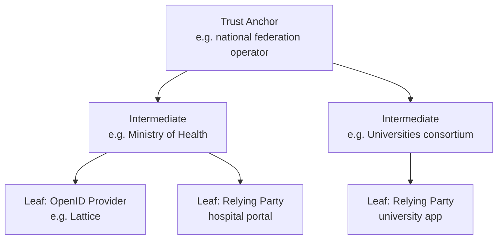

| Role                   | What it does                                                                                               |
| ---------------------- | ---------------------------------------------------------------------------------------------------------- |
| Trust Anchor (TA)      | The root of trust. Its keys are configured out-of-band, the way root CA certificates ship in a browser     |
| Intermediate Authority | Vouches for entities below it. Lets an ecosystem delegate, for example "the Ministry approves health apps" |
| Leaf entity            | Does the real work: an OP, an RP, a credential issuer, a wallet provider                                   |
| Trust Mark Issuer      | Issues signed badges such as "certified for the health sector" or "passed the security audit"              |

Every participant in the federation is an entity: Trust Anchors, Intermediates, leaves, Trust Mark Issuers and resolvers. The roles differ by where an entity sits in the tree:

- **A leaf** is an entity with no subordinates. It does the actual OIDC work.
- **A Trust Anchor** is an entity with no superior. Its Entity Configuration has no `authority_hints`, and its keys are trusted because you configured them, not because anyone vouched for it.
- **An Intermediate** has both: a superior above it and subordinates below it.

1. **The Trust Anchor publishes a self-signed Entity Configuration, like everyone else.** That's how others discover its fetch endpoint and current keys. But you don't trust it because of that file: you check that the keys in it match the ones you were configured with.
2. **Roles are relative to the chain.** An entity that is the Trust Anchor in one federation can be an Intermediate in another, for example a national federation that is itself a member of an EU-wide one. A trust chain always ends at whichever Trust Anchor you chose to trust.
3. **One entity can play several protocol roles at once.** Lattice is a single leaf entity that is both an `openid_provider` and an `openid_credential_issuer`. That's why `FederationController.java` asks Authlete for an Entity Configuration with both entity types.

### Entity Configuration: what an entity says about itself

Every entity publishes a self-signed JWT at `<entity-id>/.well-known/openid-federation`. Its media type is `application/entity-statement+jwt`, and its payload looks like this:

```json
{
  "iss": "https://op.lattice.example",
  "sub": "https://op.lattice.example",
  "iat": 1760000000,
  "exp": 1760086400,
  "jwks": { "keys": [ { "kty": "EC", "kid": "fed-1", ... } ] },
  "authority_hints": [ "https://health.gov.example" ],
  "metadata": {
    "federation_entity": { "organization_name": "Lattice" },
    "openid_provider": {
      "issuer": "https://op.lattice.example",
      "authorization_endpoint": "https://op.lattice.example/api/authorization",
      "token_endpoint": "https://op.lattice.example/api/token",
      "client_registration_types_supported": ["automatic", "explicit"],
      "federation_registration_endpoint": "https://op.lattice.example/api/federation/register"
    },
    "openid_credential_issuer": { ... }
  },
  "trust_marks": [ { "id": "https://health.gov.example/certified", "trust_mark": "eyJ..." } ]
}
```

- `iss` = `sub`: marks it as self-signed: the entity is talking about itself.
- `jwks`: holds the entity's federation keys. These sign federation statements only. They are separate from its normal OIDC signing keys, which go in the metadata as usual.
- `authority_hints`: says "my superiors are here", so others know where to look next.
- `metadata`: holds the normal OIDC/OAuth metadata, grouped by entity type, because one entity can play several roles. Ours is both an OP and a credential issuer.

On its own this proves nothing, since anyone can sign a statement about themselves. A superior has to vouch for it.

### Subordinate Statement: what a superior says about you

A superior publishes a Subordinate Statement about each entity it vouches for. It's served from the superior's fetch endpoint (`federation_fetch_endpoint?sub=<entity-id>`):

```json
{
  "iss": "https://health.gov.example",
  "sub": "https://op.lattice.example",
  "exp": 1760086400,
  "jwks": { "keys": [ { "kid": "fed-1", ... } ] },
  "metadata_policy": {
    "openid_provider": {
      "id_token_signing_alg_values_supported": { "subset_of": ["ES256", "PS256"] },
      "token_endpoint_auth_methods_supported": { "subset_of": ["private_key_jwt", "tls_client_auth"] }
    }
  },
  "constraints": { "max_path_length": 1 }
}
```

- It is signed by the superior's key (`iss` ≠ `sub`).
- Its `jwks` pins the subordinate's federation keys: "the real Lattice signs with key `fed-1`". This is what stops an impostor from publishing a fake Entity Configuration, because the impostor's key won't match the one the superior pinned.
- `metadata_policy` lets the superior restrict or modify the subordinate's metadata.
- `constraints` limits what can happen further down the tree, such as path length or allowed entity types.

### Trust chains

#### Building the chain

Suppose a hospital portal (RP) wants to trust Lattice (OP), and the RP is configured to trust `https://federation.gov.example` as its Trust Anchor.

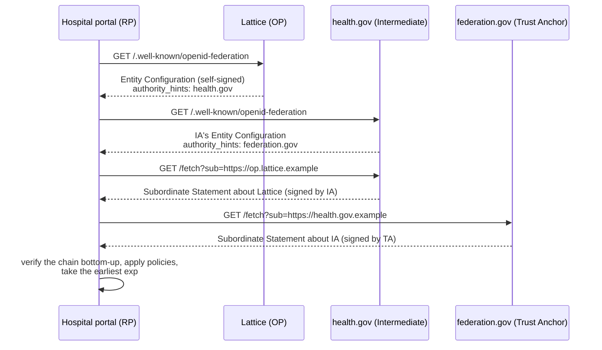

#### Verifying the chain

The resulting trust chain, a list of JWTs, is:

```text
[0] Lattice's Entity Configuration                 signed by Lattice's federation key (fed-1)
[1] health.gov's statement about Lattice           signed by health.gov's key
[2] federation.gov's statement about health.gov    signed by the Trust Anchor's key (known in advance)
```

**Verification runs from the top, which is the end you already trust:**

- Statement [2] is checked with the Trust Anchor's key, which the RP already has. Now `health.gov`'s keys are trusted.
- Statement [1] is checked with `health.gov`'s keys taken from [2]. Now Lattice's federation key `fed-1` is trusted.
- Statement [0] is checked with `fed-1` taken from [1]. Now Lattice's own metadata is trusted.
- The chain expires at the earliest `exp` in it, so trust is re-checked regularly.

If any link fails (a bad signature, an expired statement, or a superior that no longer issues a statement about you), the chain breaks and trust is gone. This is how revocation works: a superior simply stops vouching. Statements are short-lived, so removal spreads quickly without CRLs.

Leaves don't have to do all this fetching themselves. A federation can run a resolve endpoint that returns the already-verified chain and the final metadata in one call.

#### Who produces the chain

Each JWT in the chain is signed by a different entity, and the chain is simply those JWTs collected together.

| Piece                              | Produced (signed) by                  | Where it's published                                              |
| ---------------------------------- | ------------------------------------- | ----------------------------------------------------------------- |
| [0] Lattice's Entity Configuration | **Lattice** (self-signed)             | `https://op.lattice.example/.well-known/openid-federation`        |
| [1] Statement about Lattice        | **health.gov**                        | health.gov's fetch endpoint `?sub=https://op.lattice.example`     |
| [2] Statement about health.gov     | **federation.gov** (the Trust Anchor) | federation.gov's fetch endpoint `?sub=https://health.gov.example` |

Collecting the pieces into a chain is a separate job. Three different parties can do it:

- **The verifier assembles it.** This is the usual case. The party that wants to trust someone follows `authority_hints` upwards and fetches each piece, as in the sequence diagram above. When an unknown RP sends Lattice an authorization request, Authlete does this for Lattice.
- **The subject assembles it and presents it.** The RP fetches its own chain in advance and hands it over. Lattice's registration endpoint accepts exactly this: `POST /api/federation/register` with `Content-Type: application/trust-chain+json` (`FederationController.java`). This saves the verifier the network round trips.
- **A resolver assembles it.** A federation service with a resolve endpoint builds and verifies the chain, then returns the result.

Even when the subject hands over its own chain, the verifier still checks everything. It can't be faked: every piece carries a signature, and the top must be checked against a Trust Anchor key the verifier already has configured.

### Metadata policy: the ecosystem's rules, enforced automatically

Every superior in the chain can attach a `metadata_policy`. The policies are combined from the Trust Anchor down and then applied to the leaf's metadata. What comes out is the leaf's resolved metadata, the only metadata anyone actually uses.

| Operator      | Meaning                         | Example                                                         |
| ------------- | ------------------------------- | --------------------------------------------------------------- |
| `value`       | Force this value                | `"subject_type": {"value": "pairwise"}`                         |
| `default`     | Use this value if none is given | `"default_max_age": {"default": 3600}`                          |
| `add`         | Always include these            | `"contacts": {"add": ["soc@gov.example"]}`                      |
| `one_of`      | Must be one of these            | `"token_endpoint_auth_method": {"one_of": ["private_key_jwt"]}` |
| `subset_of`   | Keep only the allowed values    | Signing algorithms limited to `ES256` and `PS256`               |
| `superset_of` | Must include at least these     | Must support `S256` PKCE                                        |
| `essential`   | Must be present                 | `"jwks_uri": {"essential": true}`                               |

So a Trust Anchor can say "no RS256 anywhere in this federation" once, and it applies to every member automatically. A lower level can only tighten a rule from above, never loosen it. If two levels' policies conflict, the chain is invalid.

### How an RP registers with an OP

OpenID Federation offers two ways for an RP to start using an OP without manual setup.

#### Automatic registration (no registration step at all)

- The RP uses its Entity ID as its `client_id`.
- It sends a signed request object, so the authorization request proves it holds the RP's keys.
- The OP sees a `client_id` it has never seen before, builds the RP's trust chain up to a Trust Anchor it trusts, applies the policies, and checks the request signature against the resolved keys.
- If everything checks out, the flow continues as normal OIDC. The OP may cache the result until the chain expires.

#### Explicit registration (one call, then a normal client)

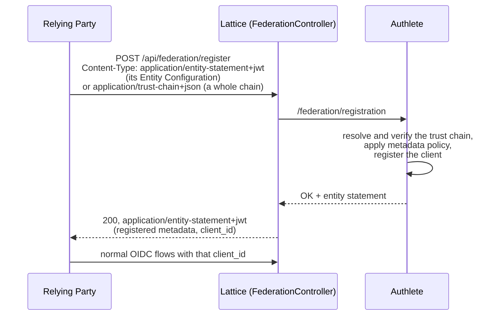

The OP's response is itself a signed entity statement containing the metadata it actually registered. The registration expires along with the trust chain.

### Trust goes both ways

The RP uses the same process to check the OP: it resolves Lattice's chain to its own Trust Anchor before sending users there. That protects users from fake identity providers, which plain OIDC discovery doesn't, because discovery just believes whatever `/.well-known/openid-configuration` returns.

### Keys and rotation

- Federation keys (`jwks` in the Entity Configuration) sign federation statements. They're pinned by your superior, so rotating them means your superior publishing a new statement. Rotation should be rare and coordinated.
- Protocol keys (`jwks` / `jwks_uri` inside `metadata.openid_provider`) sign ID tokens and similar. They're protected by the chain, so you can rotate them freely by publishing new metadata.
- There's a historical keys endpoint, so old signatures can still be checked after a rotation.

### Endpoints a federation uses

| Endpoint                                | Who serves it            | Purpose                                        |
| --------------------------------------- | ------------------------ | ---------------------------------------------- |
| `/.well-known/openid-federation`        | Every entity             | Its own Entity Configuration                   |
| `federation_fetch_endpoint`             | Superiors                | Subordinate Statement about a given `sub`      |
| `federation_list_endpoint`              | Superiors                | List of the subordinates it vouches for        |
| `federation_resolve_endpoint`           | Usually TAs or resolvers | Returns a verified chain and resolved metadata |
| `federation_trust_mark_status_endpoint` | Trust Mark Issuers       | Is this trust mark still valid?                |
| `federation_registration_endpoint`      | OPs                      | Explicit client registration                   |
| `federation_historical_keys_endpoint`   | Any                      | Retired federation keys                        |

### How Lattice implements it

Lattice is a leaf entity that acts as an OP and a credential issuer. `FederationController.java` serves two endpoints:

| Endpoint                             | What our code does                                                                                                                                                                                 | What Authlete does                                                                                                                                                         |
| ------------------------------------ | -------------------------------------------------------------------------------------------------------------------------------------------------------------------------------------------------- | -------------------------------------------------------------------------------------------------------------------------------------------------------------------------- |
| `GET /.well-known/openid-federation` | Asks Authlete for the Entity Configuration with entity types `OPENID_PROVIDER` and `OPENID_CREDENTIAL_ISSUER`, and returns it as `application/entity-statement+jwt`                                | Builds and signs the JWT from the service settings: Entity ID, federation keys, `authority_hints`, metadata, trust marks                                                   |
| `POST /api/federation/register`      | Accepts only `application/entity-statement+jwt` (an RP's Entity Configuration) or `application/trust-chain+json` (a full chain); anything else gets 415. Passes it to Authlete and maps the result | Resolves the RP's trust chain, verifies every signature up to a configured Trust Anchor, applies the metadata policies, registers the client and returns the signed result |

`GET /.well-known/openid-federation` is Lattice publishing its Entity Configuration as a leaf.

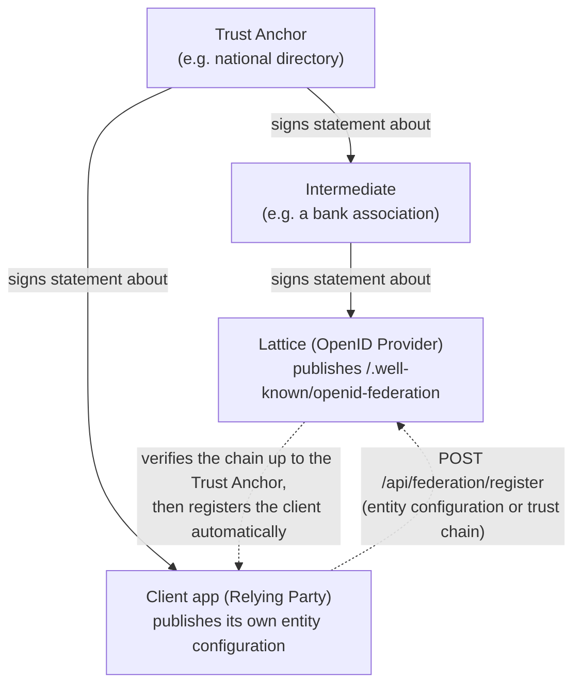

- **Question it answers**: "Can I trust this organization (client or provider)?" A common authority vouches for it.
- **Direction**: Lattice is the provider. Clients prove they belong to the federation, and Lattice registers them automatically.
- **Endpoints**:
  - `GET /.well-known/openid-federation` returns Lattice's entity configuration, a signed JWT describing it as a provider and credential issuer.
  - `POST /api/federation/register` handles explicit registration: a client sends its entity configuration or trust chain, and Authlete verifies it and creates the client.
- **Code**: `FederationController.configuration()` and `register()`. Authlete does the verification.
- **Configured in**: the Authlete service settings (trust anchors, entity ID, keys), not the identity providers file.
- **Spec**: OpenID Federation 1.0.

### Appendix: how certificate validation works (X.509)

Federation chains and certificate chains share two phases that run in opposite directions:

- **Finding the chain goes bottom-up.** The client starts from the leaf, because that's all it has.
- **Trust flows top-down.** The root is the only thing trusted to begin with, so trust is passed down from it, one signature at a time.

#### Example: a browser visiting https://example.com

##### Phase 1: build the path, bottom-up

The server sends its certificate plus the intermediate (leaf first):

```text
example.com     issued by "R11"
R11             issued by "ISRG Root X1"
```

The browser follows the issuer names upwards:

- The leaf says its issuer is "R11", and that certificate was sent along.
- R11 says its issuer is "ISRG Root X1", and that one is in the trust store that ships with the OS or browser. The search stops there.

##### Phase 2: verify, trust flowing top-down

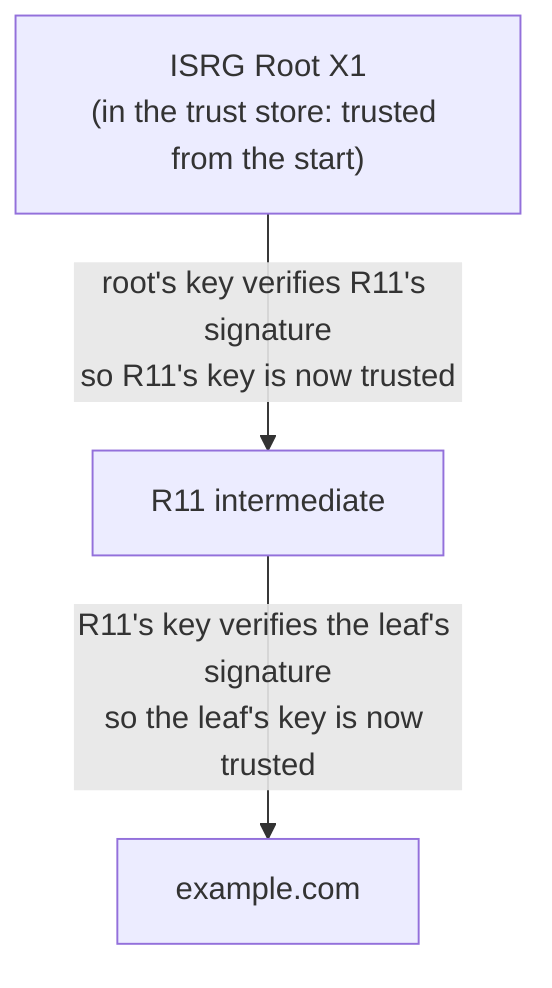

- The root's key checks the signature on R11's certificate, so R11's key can be trusted.
- R11's key checks the signature on the leaf certificate, so the leaf's key can be trusted.
- Then the leaf-specific checks: does the name match `example.com`, is it within its dates, is it allowed for TLS servers, has it been revoked?

#### In the JDK source

##### Phase 1: build the path (bottom-up)

In `SunCertPathBuilder.java`, `depthFirstSearchForward` starts at the leaf and looks up each certificate's issuer.

```java
// SunCertPathBuilder.java:269-296 (abridged)
builder.getMatchingCerts(currentState, buildParams.certStores());   // find candidate issuers
...
builder.verifyCert(cert, nextState, cpList);                        // quick checks on each candidate
...
if (builder.isPathCompleted(cert)) { ... }                          // line 316: reached a trust anchor?
...
depthFirstSearchForward(cert.getIssuerX500Principal(), nextState, ...); // line 540: recurse upward
```

The stopping test is `ForwardBuilder.isPathCompleted` (`ForwardBuilder.java:748`):

```java
for (TrustAnchor anchor : trustAnchors) {
    if (anchor.getTrustedCert() != null) {
        if (cert.equals(anchor.getTrustedCert())) {   // the cert IS a trusted root
            this.trustAnchor = anchor;
            return true;
        }
        ...
```

##### Phase 2: verify (trust flows top-down)

`PKIXCertPathValidator.validate` (`PKIXCertPathValidator.java:162`) is given one trust anchor and builds a list of checkers. `BasicChecker` is the key one:

```java
BasicChecker bc = new BasicChecker(anchor, params.date(), params.sigProvider(), false);
```

Its constructor seeds the "previous key" with the anchor's public key (`BasicChecker.java:83-93`):

```java
this.trustedPubKey = anchor.getTrustedCert().getPublicKey();
this.caName        = anchor.getTrustedCert().getSubjectX500Principal();
...
this.prevPubKey    = trustedPubKey;
```

`PKIXMasterCertPathValidator.validate` then walks the certificates in order, root side first (it takes a `reversedCertList`), and runs every checker on each. For each certificate, `BasicChecker.check` does this (lines 137-150):

```java
verifyValidity(currCert);       // cert.checkValidity(date)      — dates
verifyNameChaining(currCert);   // cert issuer DN must equal prevSubject
verifySignature(currCert);      // cert.verify(prevPubKey, ...)  — the key above verifies this cert
updateState(currCert);          // prevPubKey = currCert.getPublicKey(); prevSubject = currCert's subject
```

The initial "previous key" is the root's public key. The first certificate that gets checked is not the root.


### Why I'd still self-host rather than use the CDN:

| | Self-hosted (now) | Google Fonts CDN |
| --- | --- | --- |
| Privacy | No third party sees your users | Every visit to your sign-in page sends the user's IP to Google. A German court ruled this a GDPR violation in 2022. |
