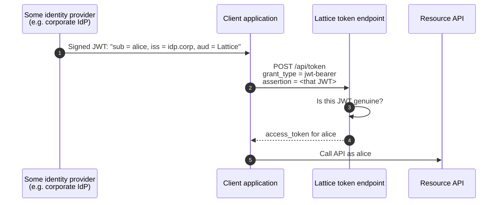
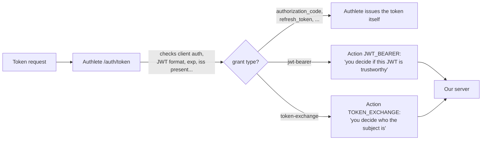
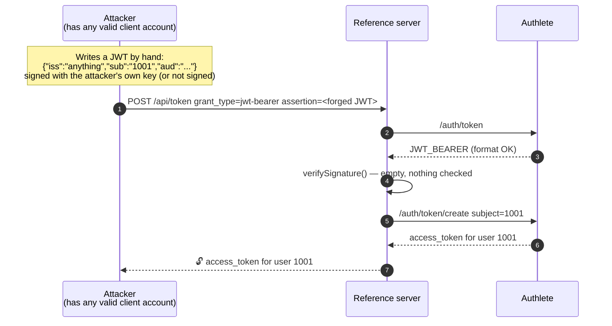
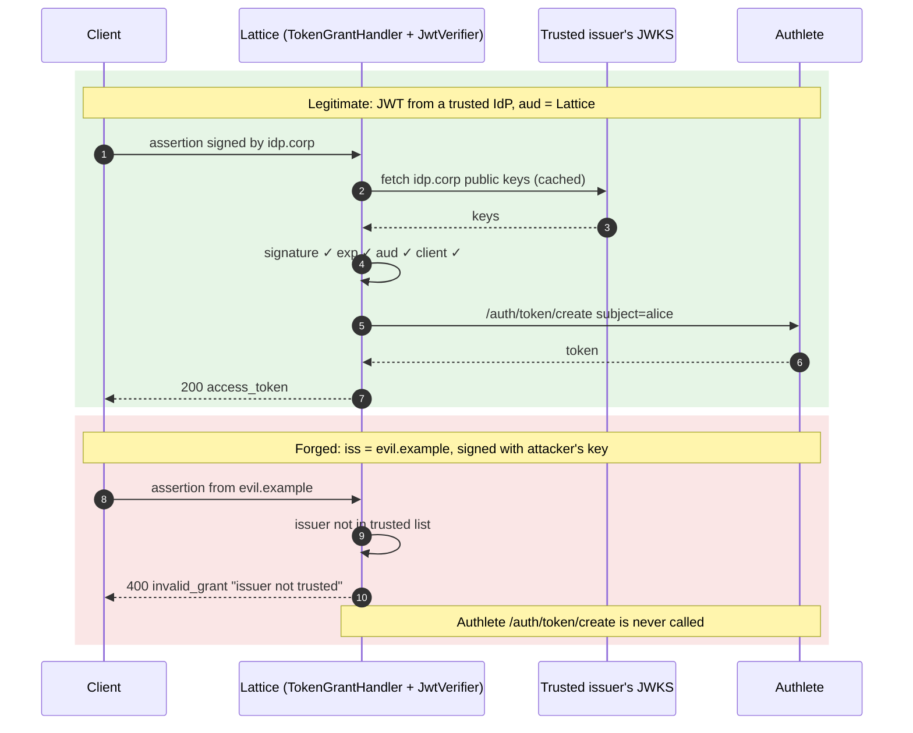
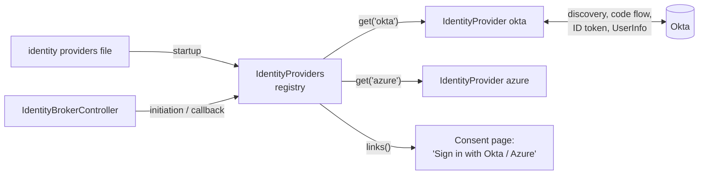
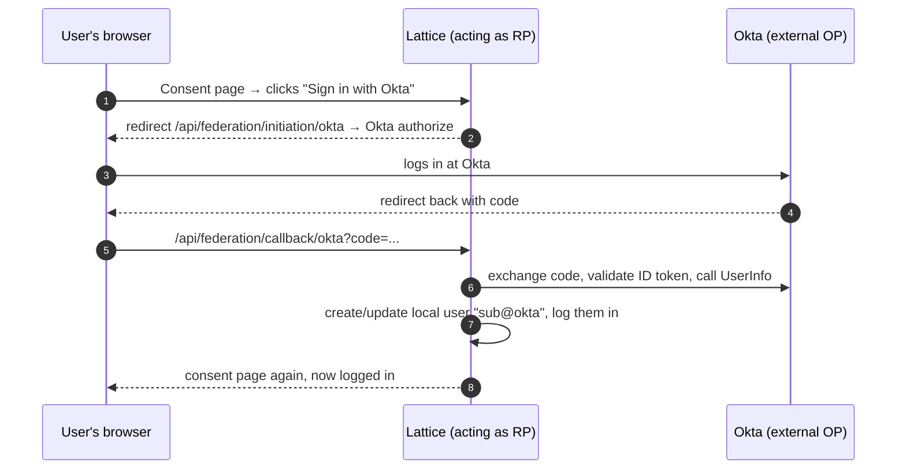
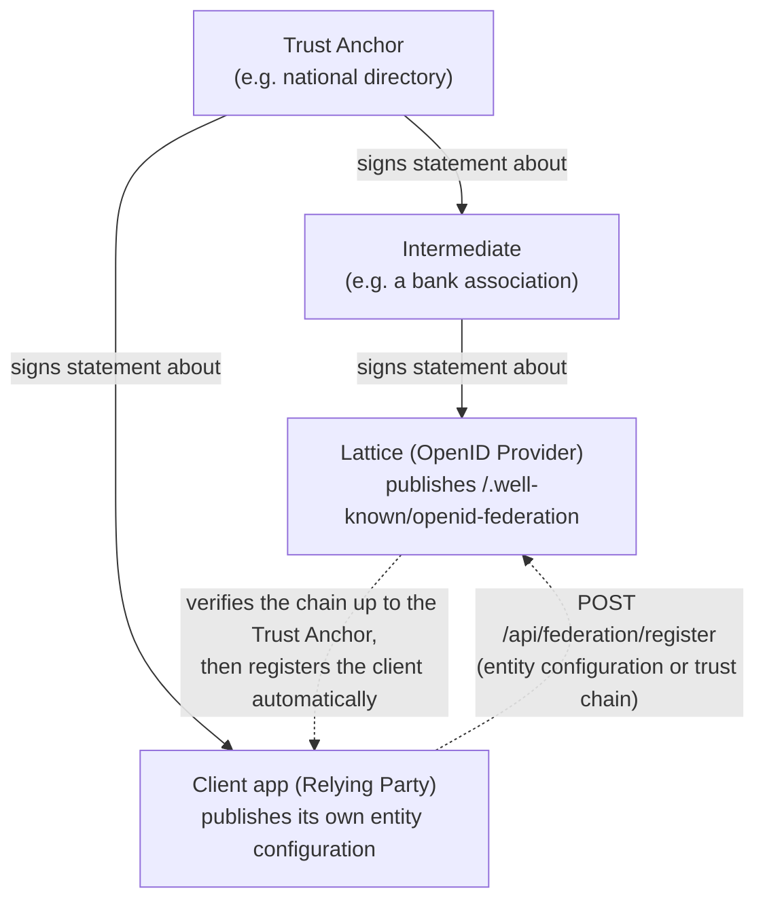
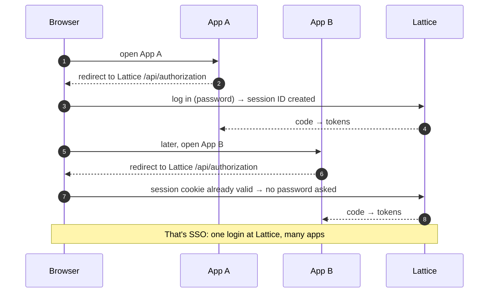
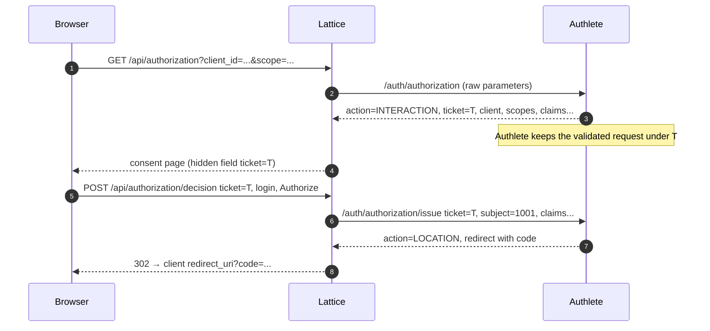
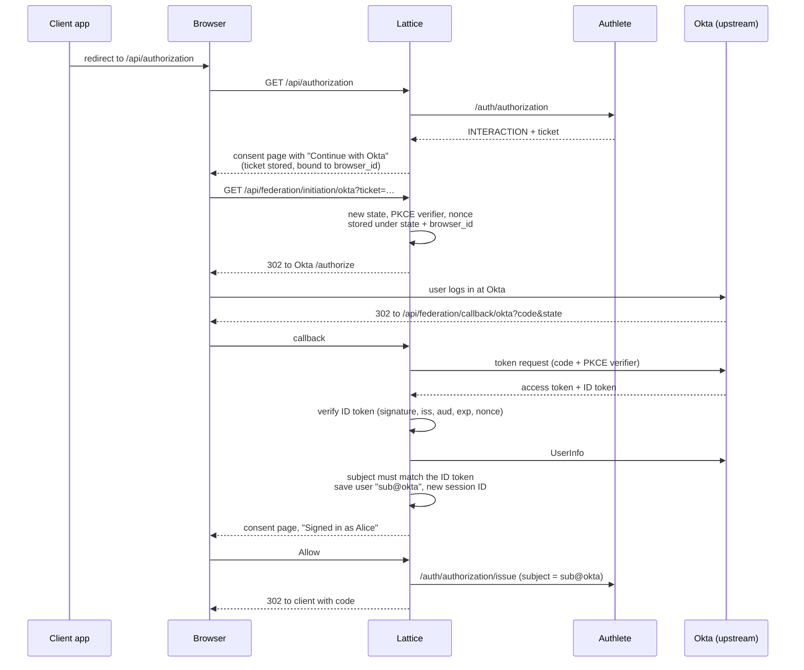

# lattice-oidc

## Security fixes compared to the reference server

- JWT bearer and token exchange: the reference never checked the signature on JWT bearer assertions or JWT subject tokens, so a forged JWT got tokens. These are now verified against this server's own Authlete keys or a configured list of trusted issuers; anything else is rejected.
- Pairwise `sub`: computed as a keyed hash per site, so it's opaque and can't be linked across clients. The reference concatenated the sector and the user ID in plain text.
- ACR: an `acr` is only asserted if it's configured as satisfied by password login. The reference echoed back whatever the client asked for.
- Login: passwords are hashed with Argon2 and accounts lock after repeated failures. Response timing doesn't reveal which accounts exist.
- Sessions: a new session ID on every login, server-side invalidation on logout, and pending flows only completable by the browser that started them.
- Browser forms: protected against cross-site form posts (CSRF), with security headers and a CSP set throughout


### Pairwise sub: a keyed hash instead of plain concatenation
What pairwise means (OIDC Core §8.1). A client registered with `subject_type=pairwise` should get a different sub for the same user than every other client, so that two sites can't compare notes and work out that they share a user.

The reference built sub as `"PAIRWISE-" + sectorIdentifier + "-" + userId`, for example `PAIRWISE-shop.example-1001`. The real user ID sits inside the string, so any two clients can strip the prefix and correlate users. It also leaks the internal user ID.

Now `(PairwiseSubjects): sub = base64url(HMAC-SHA256(secret, sector + "|" + userId))`

- Stable: the same user on the same site always gets the same value.
- Unlinkable: different sites get unrelated values.
- Not reversible without the server's secret (`PAIRWISE_SECRET`, falling back to the app secret)


### JWT bearer and token exchange: signatures are now verified

Normally a user logs in at this server through the browser. These two grants let an application get a token for a user without that browser login, by showing proof that someone else has already vouched for the user
### 



- `JWT bearer (RFC 7523)`: the proof is a JWT signed by someone (the `assertion`).
- `Token exchange (RFC 8693)`: the proof is a token the client already holds (the `subject_token`). It can be an access token, a refresh token, a JWT or an ID token.



Authlete can't verify the signature because it doesn't know which keys to trust. The JWT could be signed by any identity provider in the world, and only the deployment knows which of them it trusts. So the authorization server has to do this check itself.

Its `verifySignature()` method was empty, so it trusted whatever the JWT claimed:


Anyone with any client registration could get tokens for any user, without ever knowing that user's password. That's full account impersonation. Token exchange had the same problem with JWT and ID-token subject tokens.

*What Lattice checks now*

`TokenGrantHandler` hands the JWT to `JwtVerifier`, which only lets it through if every check below passes:


All rejections come back to the client as `400 invalid_grant` (or `invalid_request`), and no token is created.

What each check stops:

| Check | Attack it stops |
|---|---|
| Must be signed, not `alg=none`, not encrypted | "Unsigned" JWTs that anyone can write |
| Issuer must be this server or explicitly trusted | An attacker signing with their own key and naming themselves as issuer |
| Signature verified with that issuer's real keys | Forging a JWT that claims to come from a trusted issuer |
| Algorithm allow-list | Algorithm-confusion tricks, such as switching to HMAC and using the public key as the secret |
| `exp` / `nbf` | Reusing an old, leaked JWT indefinitely |
| `aud` must be this server (JWT bearer) | Replay: a genuine JWT that the IdP issued for another service, reused here |
| Client must be identifiable | Anonymous callers using the grant at all |



### Login: Argon2 hashing, lockout, and no account enumeration
- Argon2 hashing, a memory-hard algorithm that makes offline cracking expensive. Demo passwords are hashed when the store loads; nothing is stored in plain text.
- Lockout: after `lattice.login.max-failures` wrong passwords (default 5), that login ID is locked for `lattice.login.lockout` (15 minutes). While it's locked, even the correct password is refused, so an attacker can't keep guessing. The user sees "Too many failed attempts".

### Sessions: rotation, real logout, and pending flows tied to one browser
Session ID rotation (`UserSessions.login`). Every successful login creates a brand-new session ID (`session_id` in the cookie). This prevents session fixation, where an attacker plants a known session ID in the victim's browser before they log in and then rides on it afterwards.

Server-side invalidation. Play's session cookie is signed, but anyone holding a copy can replay it. So the cookie only carries the session ID, and a session counts as valid only while that session ID is registered on the server. Logout removes it there, so a stolen or replayed copy of the old cookie stops working. A test checks this. The session ID is also what back-channel logout and native SSO key on, and it is sent to clients as the `sid` claim of ID tokens and logout tokens.

Pending flows bound to the browser (`Interactions`). Each browser gets a stable random ID (`browser_id`) in its cookie. Pending consent, device-approval and federation-login state is stored server-side under its ticket or code and tagged with that `browser_id`. Completing a flow requires the same `browser_id`. That stops an attacker who learns or guesses a ticket from completing the consent or device approval from their own browser, and it stops cross-site requests from finishing someone else's flow. CSRF tokens on the forms add a second layer.

- `Single use`. The ticket is removed when it's used, so a replayed decision fails. That's tested too.


### Project structure
```sh
com.lattice.oidc
├── controllers/   thin Play controllers, one per spec area; routes point here
│                  BaseController, Authorization, Token, UserInfo, Introspection,
│                  Revocation, Par, ClientRegistration, GrantManagement, Discovery, Ciba,
│                  Device, Credential, CredentialOffer, Federation (OpenID Federation 1.0),
│                  IdentityBroker, Obb, Logout, Health, Test
├── handlers/      protocol logic: AuthorizationHandler, TokenGrantHandler (exchange/JWT bearer),
│                  NativeSsoHandler, CibaHandler, DeviceHandler, CredentialOrderHandler,
│                  ObbDcrHandler, ObbTokenHandler, LogoutHandler,
│                  IdentityProvider, IdentityProviders (identity brokering)
├── models/        AuthorizationPage, AuthorizationInteraction, Consent, User, IdentityProviderConfig, ...
├── security/      LoginService, UserSessions, Interactions, JwtVerifier, PairwiseSubjects,
│                  ObbCertValidator, AuditService
├── stores/        UserStore, InMemoryUserStore, ConsentStore
├── client/        Authlete Play WS client, ServerMetadata
├── filters/       RequestIdFilter, HstsFilter, AccessLogFilter
├── common/        Requests, Responses, Jsons, WebException, ErrorHandler, Redaction, LatticeConfig
└── modules/       AuthleteModule
```

## Identity brokering
Identity brokering lets users sign in to Lattice with an existing account at an external identity provider such as Okta, Azure AD or Google. Lattice delegates authentication to that provider, verifies the result, and maps the external identity to a local account (for example `alice@okta`) with its own Lattice session. Keycloak calls this feature Identity Brokering; it is also known as social login or upstream identity providers.

*IdentityProvider: one upstream provider (`handlers/IdentityProvider.java`, Keycloak: `OIDCIdentityProvider`)*

Each instance is the relying-party client for a single OpenID Provider (one entry in the identity providers file, for example `"okta"`). It does the actual protocol work with that provider:

- `Discovery`: fetches and caches the provider's /.well-known/openid-configuration and checks that issuer matches.
- `authenticationRequest(state, verifier, nonce)`: builds the redirect URL to the provider's authorization endpoint, using the code flow with PKCE, `state` and `nonce`.
- `complete(callbackUrl, state, verifier, nonce)`:
  1. Parses the `callback` and checks `state`.
  2. Exchanges the code at the provider's token endpoint.
  3. Validates the ID token (signature from the provider's JWKS, issuer, audience, nonce).
  4. Calls UserInfo and checks that its `sub` matches the ID token's.


*IdentityProviders: the registry (`handlers/IdentityProviders.java`)*

A `@Singleton `that holds every configured provider:

- At startup: reads the JSON file named by `lattice.identity-providers.file` (`IDENTITY_PROVIDERS_FILE`; `FEDERATIONS_FILE` is still accepted), skips incomplete entries with a warning, and creates one `IdentityProvider` per valid entry. The file format is java-oauth-server's `federations.json`.
- `get(id)`: looks up the `IdentityProvider` for an ID such as "okta". `IdentityBrokerController` uses it in `/api/federation/initiation/:id` and `/api/federation/callback/:id`.
- `links()`: returns (id, name) pairs so the consent page can show "Or sign in with: Okta, …".


Lattice is the client here, and an external provider (Okta, Azure AD, Google…) authenticates the user.



- `Question it answers`: "Who is this user?" Another provider vouches for them.
- `Direction`: Lattice is the client of Okta. It has a client_id and secret at Okta.
- `Code`: `IdentityProvider`, `IdentityProviders`, and `IdentityBrokerController` (`initiation`, `callback`).
- `Configured in`: the identity providers file (`lattice.identity-providers.file`).
- `Spec`: plain OpenID Connect, with Lattice on the client side


## OpenID Federation 1.0: trust between organizations
OpenID Federation 1.0: a trust framework that lets client applications and providers trust each other through a shared authority, so clients don't need to be registered manually. This is what `/.well-known/openid-federation` and `/api/federation/register` implement.


Lattice is the provider here. Instead of every client being registered in advance, a shared trust anchor (for example a national open-banking directory) vouches for both the provider and its clients. Trust is checked by following a chain of signed statements



- `Question it answers`: "Can I trust this organization (client or provider)?" A common authority vouches for it.
- `Direction`: Lattice is the provider. Clients prove they belong to the federation, and Lattice registers them automatically.
- `Endpoints`:
  - `GET /.well-known/openid-federation` returns Lattice's entity configuration, a signed JWT describing it as a provider and credential issuer.
  - `POST /api/federation/register` handles explicit registration: a client sends its entity configuration or trust chain, and Authlete verifies it and creates the client.
- `Code`: `FederationController.configuration()` and `register()`. Authlete does the verification.
Configured in: the Authlete service settings (trust anchors, entity ID, keys), not federations.json.
- `Spec`: OpenID Federation 1.0.





## Tickets: a handle for pending requests
A ticket is Authlete's handle for a request it is in the middle of processing. When Authlete can't finish a request on its own (for example, it needs the user to log in and consent), it remembers the parsed request on its side and gives Lattice an opaque string, the ticket. Lattice later sends that ticket back to finish the request (issue) or reject it (fail).



## Running the server in production
```sh
sbt --client stage
APPLICATION_SECRET=$(openssl rand -hex 32) \
AUTHLETE_SERVICE_APIKEY=<id> AUTHLETE_SERVICE_ACCESSTOKEN=<token> \
target/universal/stage/bin/lattice-oidc -Dhttp.port=9000
```

## A user signing in with Okta

