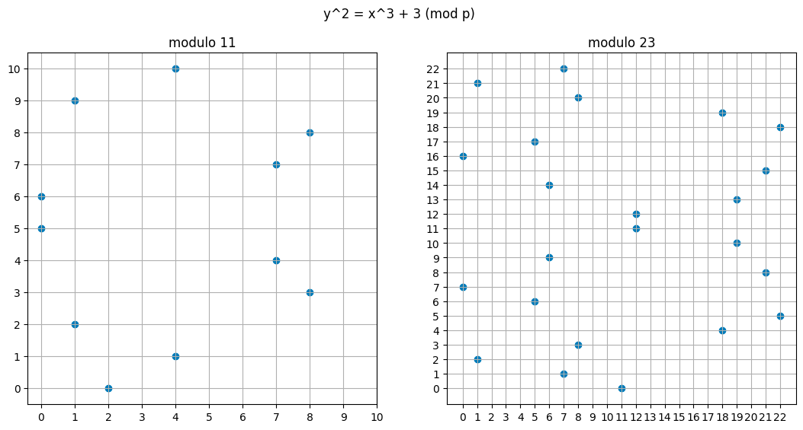
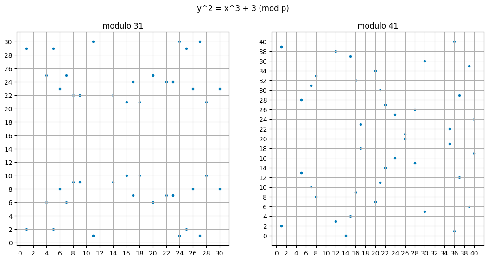

# Modular arithmetic

Modular arithmetic is arithmetic where numbers wrap around after reaching a fixed value, the **modulus**. It underlies most of the cryptography Lattice relies on:

- **Elliptic curve keys** (ES256 tokens, passkeys): every coordinate is computed mod a 256-bit prime.
- **RSA** (RS256 tokens): signing computes $m^d \bmod n$.
- **Authenticator codes** (TOTP): the 6-digit code is a number reduced mod $10^6$ ([Totp.java](app/com/lattice/oidc/security/Totp.java)).

## Clock arithmetic

A clock works mod 12: 10:00 plus 4 hours is 2:00, not 14:00. Every value is replaced by its remainder after division by the modulus. This is called **modular reduction**:

$$
10 + 4 = 14 \equiv 2 \pmod{12}
$$

## Congruence

The symbol $\equiv$ means "congruent": their difference is a multiple of the modulus. Equivalently, both sides leave the same remainder from $0$ to $m - 1$ when divided by the modulus $m$. It is used instead of $=$ because the two sides usually only match after wrapping around. For example, $6^2 = 36$, and $36 \equiv 2 \pmod{17}$ because $36 - 2 = 34$ is a multiple of 17.

**Formal definition.** Let $a, r, m \in \mathbb{Z}$ with $m > 0$. We write

$$
a \equiv r \pmod{m}
$$

if $m$ divides $a - r$, written $m \mid (a - r)$. $m$ is the **modulus** and $r$ a **remainder**. In the example, $17 \mid (36 - 2)$ because $34 = 2 \times 17$.

## The remainder is not unique

Take $a = 42$ and $m = 9$. Each way of writing 42 as a multiple of 9 plus something gives a valid remainder:

| Write 42 as | Remainder $r$ | Check: $9 \mid (42 - r)$ |
| --- | --: | --- |
| $42 = 4 \cdot 9 + 6$ | $6$ | $42 - 6 = 36 = 4 \cdot 9$ ✓ |
| $42 = 3 \cdot 9 + 15$ | $15$ | $42 - 15 = 27 = 3 \cdot 9$ ✓ |
| $42 = 5 \cdot 9 + (-3)$ | $-3$ | $42 + 3 = 45 = 5 \cdot 9$ ✓ |

So $42 \equiv 6 \equiv 15 \equiv -3 \pmod{9}$. **The remainder is not unique:** any two remainders differ by a multiple of $m$.

When a single value is wanted, the convention is the one from $0$ to $m - 1$, written $42 \bmod 9 = 6$.

**In code.** Java's `%` keeps the sign of the left operand, so it can return a negative remainder: `-3 % 9` is `-3`. `Math.floorMod(-3, 9)` returns `6`, the conventional one. `Totp.java` can use `%` safely because it masks the sign bit first (`& 0x7f`), so the number is never negative.

## Equivalence classes

Take $a = 12$ and $m = 5$:

| Congruence | Check |
| --- | --- |
| $12 \equiv 2 \pmod{5}$ | $5 \mid (12 - 2) = 10$ ✓ |
| $12 \equiv 7 \pmod{5}$ | $5 \mid (12 - 7) = 5$ ✓ |
| $12 \equiv -3 \pmod{5}$ | $5 \mid (12 - (-3)) = 15$ ✓ |

**Definition.** The set

$$
\lbrace \ldots, -8, -3, 2, 7, 12, 17, \ldots \rbrace
$$

forms an **equivalence class** modulo 5: each member is the previous one plus 5. All members of the class behave equivalently modulo 5.

### All the classes modulo 5

Every integer falls into exactly one of five classes:

| Class | Members | Smallest non-negative member |
| :-: | --- | :-: |
| A | $\lbrace \ldots, -10, -5, 0, 5, 10, \ldots \rbrace$ | 0 |
| B | $\lbrace \ldots, -9, -4, 1, 6, 11, 16, \ldots \rbrace$ | 1 |
| C | $\lbrace \ldots, -8, -3, 2, 7, 12, \ldots \rbrace$ | 2 |
| D | $\lbrace \ldots, -7, -2, 3, 8, 13, \ldots \rbrace$ | 3 |
| E | $\lbrace \ldots, -6, -1, 4, 9, 14, \ldots \rbrace$ | 4 |

In general there are $m$ classes modulo $m$. Picking the smallest non-negative member of each gives the set $\mathbb{Z}_m = \lbrace 0, 1, \ldots, m - 1 \rbrace$, which is what computers work with.

## Computing with classes

Because all members of a class behave the same way, any member can stand in for its class. Compute $13 \cdot 16 - 8 \pmod{5}$. Done directly, it needs a multiplication first:

$$
13 \cdot 16 - 8 = 208 - 8 = 200 \equiv 0 \pmod{5}
$$

Instead, look up each number's class: 13 is in D, 16 in B and 8 in D. The expression becomes $D \cdot B - D$, and each class can be replaced by its smallest member (D by 3, B by 1):

$$
3 \cdot 1 - 3 = 3 - 3 = 0 \pmod{5}
$$

Any other members work too. Take 8 from D, 6 from B and $-7$ from D:

$$
8 \cdot 6 - (-7) = 48 + 7 = 55 \equiv 0 \pmod{5}
$$

| Pick from D | Pick from B | Pick from D | $D \cdot B - D$ | Class |
| --: | --: | --: | --: | :-: |
| 13 | 16 | 8 | $208 - 8 = 200$ | A |
| 3 | 1 | 3 | $3 - 3 = 0$ | A |
| 8 | 6 | $-7$ | $48 + 7 = 55$ | A |

All three land in class A, because 200, 0 and 55 are all multiples of 5. The result depends only on the classes, not on which members are picked, so the smallest members, which you can work with in your head, are always allowed.

### Important application: reduce early

Compute $3^8 \bmod 7$. Modulo 7 there are seven classes, one for each remainder from 0 to 6. Two of them matter here:

| Class | Members | Smallest non-negative member |
| :-: | --- | :-: |
| of 2 | $\lbrace \ldots, -5, 2, 9, 16, \ldots, 6561, \ldots \rbrace$ | 2 |
| of 4 | $\lbrace \ldots, -3, 4, 11, \ldots, 81, \ldots \rbrace$ | 4 |

**1st way: compute the power, then reduce.**

$$
3^8 = 6561 = 937 \cdot 7 + 2 \equiv 2 \pmod{7}
$$

Correct, but it needs the full number 6561 first.

**2nd way: split the power, and reduce the pieces.**

$$
3^8 = 3^4 \cdot 3^4 = 81 \cdot 81
$$

Before multiplying, replace 81 by the smallest member of its class. $81 = 11 \cdot 7 + 4$, so 81 is in the class of 4:

$$
81 \cdot 81 \equiv 4 \cdot 4 = 16 = 2 \cdot 7 + 2 \equiv 2 \pmod{7}
$$

Same answer, and the largest number ever written is 81 instead of 6561. This works for the same reason as $D \cdot B - D$ above: 81 and 4 are in the same class, so either can stand in the product.

Doing this at every step is **repeated squaring**. Square, reduce, square again:

$$
3^2 = 9 \equiv 2 \qquad 3^4 \equiv 2^2 = 4 \qquad 3^8 \equiv 4^2 = 16 \equiv 2 \pmod{7}
$$

Every intermediate result stays below 7, however large the exponent. For 8 the difference is 6561 against 16. For RSA it decides whether the computation is possible at all. With a 3072-bit modulus, $m^d$ written out in full would have more digits than there are atoms in the universe. Reduced after every squaring, each step stays at 3072 bits.

## Rings: an algebraic view

An **integer ring** $\mathbb{Z}_m$ is an algebraic structure consisting of the set of integers from $0$ to $m - 1$, equipped with two core operations: addition and multiplication.

Reducing early means every result can be kept inside $\lbrace 0, 1, \ldots, m - 1 \rbrace$. Modular arithmetic is then **computation in a finite set**: add or multiply two members, reduce, and the answer is a member again. The set with its two operations is called a ring.

**Definition.** The **integer ring** $\mathbb{Z}_m$ consists of:

1. The set $\mathbb{Z}_m = \lbrace 0, 1, \ldots, m - 1 \rbrace$.
2. Two operators, "$+$" and "$\cdot$": for all $a, b \in \mathbb{Z}_m$, there are $c, d \in \mathbb{Z}_m$ with
   1. $a + b \equiv c \pmod{m}$
   2. $a \cdot b \equiv d \pmod{m}$

The modulus is an integer $m \ge 2$, and $\mathbb{Z}_m$ has exactly $m$ elements. ($m = 1$ gives $\lbrace 0 \rbrace$, where $0 = 1$, which is of no use.) The operations are well defined: as [Computing with classes](#computing-with-classes) showed, the result depends only on the classes, not on which members are used.

**Example.** In $\mathbb{Z}_9 = \lbrace 0, 1, \ldots, 8 \rbrace$, take $a = 6$ and $b = 8$:

$$
6 + 8 = 14 \equiv 5 \pmod{9} \qquad 6 \cdot 8 = 48 \equiv 3 \pmod{9}
$$

Both answers, 5 and 3, are in $\mathbb{Z}_9$, like every answer of $+$ and $\cdot$.

### Properties

For all $a, b, c \in \mathbb{Z}_m$:

| Property | Statement | Example in $\mathbb{Z}_9$ |
| --- | --- | --- |
| Closed | Adding or multiplying any two numbers gives a number in the ring | $6 + 8 \equiv 5$, $6 \cdot 8 \equiv 3$ |
| Associative | $a + (b + c) = (a + b) + c$ and $a \cdot (b \cdot c) = (a \cdot b) \cdot c$ | $6 + (8 + 4) \equiv (6 + 8) + 4 \equiv 0$; $2 \cdot (4 \cdot 5) \equiv (2 \cdot 4) \cdot 5 \equiv 4$ |
| Commutative | $a + b = b + a$ and $a \cdot b = b \cdot a$ | $8 + 6 \equiv 5$, $8 \cdot 6 \equiv 3$ |
| Neutral element 0 of addition | $a + 0 \equiv a \pmod{m}$ | $6 + 0 \equiv 6$ |
| Additive inverse (always exists) | every $a$ has a negative element $-a$ with $a + (-a) \equiv 0 \pmod{m}$ | $-7 \equiv 2$, since $7 + 2 = 9 \equiv 0$ |
| Neutral element 1 of multiplication | $a \cdot 1 \equiv a \pmod{m}$ | $6 \cdot 1 \equiv 6$ |
| Multiplicative inverse (only some) | some, but not all, $a$ have an $a^{-1}$ with $a \cdot a^{-1} \equiv 1 \pmod{m}$ | $2^{-1} = 5$, since $2 \cdot 5 = 10 \equiv 1$; 3 has none |
| Distributive | $a \cdot (b + c) = (a \cdot b) + (a \cdot c)$ | $2 \cdot (4 + 7) \equiv 2 \cdot 4 + 2 \cdot 7 \equiv 4$ |

A ring with all of these is a **commutative ring with identity** (the identity is 1).

### Subtraction: always possible

The negative element is unique, and it is easy to find: $-0 = 0$, and for $a \ne 0$, $-a = m - a$. Subtracting is adding the negative element:

$$
a - b \equiv a + (m - b) \pmod{m}
$$

In $\mathbb{Z}_9$: $-7 = 9 - 7 = 2$, and $4 - 7 \equiv 4 + 2 = 6$.

### Division: only by elements with an inverse

If $a$ has an inverse, we can divide by it, because dividing by $a$ means multiplying by $a^{-1}$:

$$
b / a \equiv b \cdot a^{-1} \pmod{m}
$$

**Example: the inverse of 2 in $\mathbb{Z}_9$.** We need $2^{-1}$ with

$$
2 \cdot 2^{-1} \equiv 1 \pmod{9}
$$

Trying the elements, $2 \cdot 5 = 10 \equiv 1 \pmod{9}$, so

$$
2^{-1} \equiv 5 \pmod{9}
$$

It exists because $\gcd(2, 9) = 1$. With it, dividing by 2 works: $7 / 2 \equiv 7 \cdot 5 = 35 \equiv 8$, and indeed $2 \cdot 8 = 16 \equiv 7$.

**Example: 6 has no inverse in $\mathbb{Z}_9$.** We would need

$$
6 \cdot 6^{-1} \equiv 1 \pmod{9}
$$

but $\gcd(6, 9) = 3 \ne 1$. Every multiple of 6 is a multiple of 3, so $6 \cdot x \bmod 9$ is always 0, 3 or 6, never 1:

| $x$ | 0 | 1 | 2 | 3 | 4 | 5 | 6 | 7 | 8 |
| --- | --: | --: | --: | --: | --: | --: | --: | --: | --: |
| $6 \cdot x \bmod 9$ | 0 | 6 | 3 | 0 | 6 | 3 | 0 | 6 | 3 |

- **Which elements have one:** $a$ has an inverse exactly when $a$ and $m$ share no factor, $\gcd(a, m) = 1$. In $\mathbb{Z}_9$ those are 1, 2, 4, 5, 7 and 8; 0, 3 and 6 have none. 0 never has one: $0 \cdot x \equiv 0$, never 1.
- **Unique:** an element has at most one inverse. In $\mathbb{Z}_9$ they pair up as $1 \leftrightarrow 1$, $2 \leftrightarrow 5$, $4 \leftrightarrow 7$ and $8 \leftrightarrow 8$.
- **How to find one:** the extended Euclidean algorithm computes $a^{-1}$ while it computes $\gcd(a, m)$. For a large modulus, nobody searches.
- **How many:** the number of invertible elements is Euler's phi function, $\varphi(m)$. $\varphi(9) = 6$. For a prime $p$, $\varphi(p) = p - 1$: everything except 0.
- **They form a group:** the invertible elements, $\mathbb{Z}_m^*$, are closed under $\cdot$. The product of two invertible elements is invertible, with $(a \cdot b)^{-1} = b^{-1} \cdot a^{-1}$. So $\mathbb{Z}_9^* = \lbrace 1, 2, 4, 5, 7, 8 \rbrace$ is a group under multiplication.

### Zero divisors and cancellation

When $m$ is composite, two non-zero elements can multiply to zero. These are **zero divisors**. In $\mathbb{Z}_9$: $3 \cdot 3 = 9 \equiv 0$ and $3 \cdot 6 = 18 \equiv 0$. In $\mathbb{Z}_m$, every non-zero element is either invertible or a zero divisor, never both. If $\gcd(a, m) = g > 1$, then $a \cdot (m / g) \equiv 0$ with $m / g \ne 0$.

Because of them, **cancelling isn't always allowed.** $a \cdot b \equiv a \cdot c$ implies $b \equiv c$ only when $a$ is invertible (multiply both sides by $a^{-1}$). In $\mathbb{Z}_9$: $3 \cdot 1 \equiv 3 \cdot 4 \equiv 3$, but $1 \not\equiv 4$.

### Prime modulus: a field

$\mathbb{Z}_m$ is a **field** exactly when $m$ is a prime $p$. Then every non-zero element has an inverse, there are no zero divisors, and cancelling always works. This field is written $\mathbb{F}_p$ or $\mathrm{GF}(p)$. In $\mathbb{Z}_7$ the inverses are $1 \leftrightarrow 1$, $2 \leftrightarrow 4$, $3 \leftrightarrow 5$ and $6 \leftrightarrow 6$. The next section shows the composite and prime cases side by side.

### Powers

$a^k$ is $a$ multiplied by itself $k$ times, reduced as you go ([Important application: reduce early](#important-application-reduce-early)). Two theorems make powers in $\mathbb{Z}_m$ repeat:

- **Fermat's little theorem:** for a prime $p$ and any $a$ not divisible by $p$, $a^{p-1} \equiv 1 \pmod{p}$. In $\mathbb{Z}_7$: $3^6 = 729 \equiv 1$. That is why $3^8 = 3^6 \cdot 3^2 \equiv 3^2 = 9 \equiv 2 \pmod 7$, the same answer as before. It also gives an inverse: $a^{-1} \equiv a^{p-2} \pmod{p}$, for example $2^{-1} \equiv 2^5 = 32 \equiv 4 \pmod 7$.
- **Euler's theorem**, for any $m$: if $\gcd(a, m) = 1$, then $a^{\varphi(m)} \equiv 1 \pmod{m}$. In $\mathbb{Z}_9$: $2^6 = 64 \equiv 1$.

### Other facts

- **Adding 1 to itself:** $m$ ones add up to 0 ($1 + 1 + \cdots + 1 \equiv m \equiv 0$), and no smaller number of them does. $m$ is the ring's **characteristic**.
- **Every element is a sum of ones:** under addition alone, $\mathbb{Z}_m$ is a cyclic group generated by 1.

### Where cryptography uses which

RSA computes in the ring $\mathbb{Z}_n$, Diffie–Hellman in the group $\mathbb{Z}_p^*$, and elliptic curves over the field $\mathbb{F}_p$. [Which cryptography uses which structure](#which-cryptography-uses-which-structure) has the full list.

## Division and inverses

"Dividing by $a$" means multiplying by the **inverse** of $a$: the number $a^{-1}$ with $a \times a^{-1} \equiv 1 \pmod{m}$. As the ring's properties say, not every number has one.

**The trap of composite numbers.** Take a non-prime modulus such as 6. The numbers are 0 to 5. To find the inverse of 2, we need an $x$ with $2 \times x \equiv 1 \pmod{6}$:

| $x$ | $2 \times x$ | $\bmod 6$ |
| --: | --: | --: |
| 1 | 2 | 2 |
| 2 | 4 | 4 |
| 3 | 6 | **0** |
| 4 | 8 | 2 |
| 5 | 10 | 4 |

- **No inverse.** $2 \times x$ never equals 1, because 2 shares a factor with 6. So 2 has no inverse, and nothing can be divided by 2.
- **A zero divisor.** Worse, $2 \times 3 \equiv 0$: two non-zero numbers multiply to zero. Information is lost, because you can't tell what was multiplied by 2 to get 0.

**The prime guarantee.** Now use a prime modulus such as 7. The numbers are 0 to 6. Find the inverse of 2 again:

| $x$ | $2 \times x$ | $\bmod 7$ |
| --: | --: | --: |
| 1 | 2 | 2 |
| 2 | 4 | 4 |
| 3 | 6 | 6 |
| 4 | 8 | **1** |

The inverse of 2 is 4. This isn't luck: a prime has no divisors other than 1 and itself, so no number from 1 to $p - 1$ shares a factor with it. That guarantees:

- every non-zero number has exactly one inverse, so division always works;
- no two non-zero numbers multiply to zero, so nothing collapses.

This is why an elliptic curve's modulus is always prime: its point-addition rule divides (the slope $\frac{y_2 - y_1}{x_2 - x_1}$), so every non-zero number must have an inverse. The README's [Elliptic curve keys](README.md#elliptic-curve-keys-how-they-work) section shows the curve built on top of this.

## Groups, rings and fields

$\mathbb{Z}_m$ is one example of three structures that algebra defines by their rules (axioms). The rules, not the particular numbers, are what proofs and algorithms rely on.

An **algebraic structure** is a set of objects together with one or more operations on them, and structures are classified by which rules their operations obey. The objects don't have to be numbers: the points of an elliptic curve form a group ([below](#elliptic-curves-a-group-made-of-points)). For a fuller treatment, see these [Oxford lecture notes on groups, rings and fields](https://people.maths.ox.ac.uk/flynn/genus2/sheets0405/grfnotes1011.pdf).

**In one line each:**
- **Group:** one operation. It always works and can always be undone: every element has an inverse for that operation.
- **Ring:** two operations, $+$ and $\times$. Addition can always be undone (subtraction). Multiplication cannot always be undone: division works only for some elements.
- **Field:** two operations, and both can always be undone, except that there is no dividing by 0.

### Group

A **group** is a set $G$ with one operation $*$ that is **closed** (for any $x, y \in G$, $x * y \in G$) and satisfies:

1. **Identity:** there is an element $e$ with $e * x = x * e = x$ for every $x$.
2. **Inverse:** every $x$ has an element $y$ with $x * y = y * x = e$, written $x^{-1}$, or $-x$ when the operation is addition.
3. **Associativity:** $x * (y * z) = (x * y) * z$ for all $x, y, z$.

A group is **abelian** (commutative) if also $x * y = y * x$ for all $x, y$.

Two consequences hold in every group: the identity and each inverse are **unique**, and **cancellation** works ($x * y = x * z$ implies $y = z$, by applying $x^{-1}$ on the left).

| Example | Operation | Abelian | Why it is (or isn't) a group |
| --- | --- | :-: | --- |
| $\mathbb{Z}_n$ | $+$ modulo $n$ | yes | identity 0, inverse of $a$ is $n - a$ |
| $\mathbb{Z}_n^*$, the numbers coprime to $n$ | $\cdot$ modulo $n$ | yes | identity 1; every coprime number has an inverse |
| $\mathbb{Z}$, the integers | $+$ | yes | groups can be infinite |
| $\mathbb{Z}$, the integers | $\cdot$ | — | **not a group**: 2 has no inverse, because $\tfrac{1}{2} \notin \mathbb{Z}$ |
| All of $\mathbb{Z}_n$ | $\cdot$ modulo $n$ | — | **not a group**: 0 has no inverse, and neither does any number sharing a factor with $n$ |
| The 6 symmetries of an equilateral triangle | composition | **no** | the smallest group that isn't abelian: a rotation then a flip differs from that flip then the rotation |

**Group size and powers (Lagrange).** In a finite group with $N$ elements, every element satisfies $x^N = e$. Two theorems from [Powers](#powers) are special cases:

- $\mathbb{Z}_p^*$ has $p - 1$ elements, so $x^{p-1} \equiv 1 \pmod{p}$: **Fermat's little theorem**.
- $\mathbb{Z}_n^*$ has $\varphi(n)$ elements, so $x^{\varphi(n)} \equiv 1 \pmod{n}$: **Euler's theorem**.

### Ring

A **ring** is a set $R$ with two operations, $+$ and $\times$, closed under both, such that:

1. $R$ is an **abelian group under $+$**: closure, associativity, an identity 0, and a negative $-a$ for every $a$ (so subtraction always works).
2. **$\times$ is associative:** $a \times (b \times c) = (a \times b) \times c$.
3. **Distributive** on both sides: $a \times (b + c) = (a \times b) + (a \times c)$ and $(b + c) \times a = (b \times a) + (c \times a)$.

Multiplicative inverses are **not** required. Textbooks differ on two extras. Many require a multiplicative identity 1 (a "ring with unity"); others don't, and some call a ring without 1 a "rng". Commutative multiplication is never required: a ring that has it is a **commutative ring**. $\mathbb{Z}_m$ has both extras, so it is a ring under either convention.

| Example | Note |
| --- | --- |
| $\mathbb{Z}_n$ | commutative, with 1; zero divisors when $n$ is composite |
| $\mathbb{Z}$ | commutative, with 1; only $1$ and $-1$ have multiplicative inverses |
| $\mathbb{Z}[x]$, polynomials with integer coefficients | the usual polynomial addition and multiplication |
| $n \times n$ matrices with integer entries | multiplication is **not** commutative: a non-commutative ring |

### Field

A **field** is a set $F$ with two operations, $+$ and $\times$, such that:

1. $F$ is an **abelian group under $+$**, and
2. $F \setminus \lbrace 0 \rbrace$, everything except 0, is an **abelian group under $\times$**.

Equivalently, a field is a commutative ring with a 1 different from 0, in which every non-zero element has a multiplicative inverse, so you can divide by anything except 0.

| Example | Size |
| --- | --- |
| $\mathbb{Q}$ (rationals), $\mathbb{R}$ (reals), $\mathbb{C}$ (complex numbers) | infinite |
| $\mathbb{Z}_p$ for a prime $p$, also written $\mathbb{Z}/p\mathbb{Z}$, $\mathbb{F}_p$ or $\mathrm{GF}(p)$ | $p$ |
| $\mathrm{GF}(2^8)$, $\mathrm{GF}(2^{128})$ and other $\mathrm{GF}(p^k)$ (below) | $p^k$ |

**Non-examples.** $\mathbb{Z}$ is not a field, because 2 has no inverse. $\mathbb{Z}_n$ for a composite $n$ is not a field, because the non-zero elements sharing a factor with $n$ have no inverse, so $\mathbb{Z}_n \setminus \lbrace 0 \rbrace \ne \mathbb{Z}_n^*$.

### Finite fields of every prime-power size

A finite field exists for exactly the sizes that are a power of a prime, $p^k$, and for each such size there is only one, up to renaming its elements. For $k = 1$ it is $\mathbb{Z}_p$. For $k > 1$ it is **not** $\mathbb{Z}_{p^k}$. For example, $\mathbb{Z}_{256}$ is not a field: 2 has no inverse modulo 256.

$\mathrm{GF}(p^k)$ is built from polynomials instead:
- **Elements:** polynomials of degree below $k$ with coefficients in $\mathbb{Z}_p$.
- **Multiplication:** reduced modulo a fixed irreducible polynomial of degree $k$, one that can't be factored, which plays the role a prime plays for $\mathbb{Z}_p$.

**$\mathrm{GF}(2^8)$, the field AES uses.** A byte $b_7 b_6 \ldots b_0$ is the polynomial $b_7 x^7 + \cdots + b_1 x + b_0$ with bits as coefficients:

- **Addition** is XOR, because coefficients are added modulo 2: $\lbrace 57 \rbrace + \lbrace 83 \rbrace = \lbrace d4 \rbrace$ (hexadecimal).
- **Multiplication** is polynomial multiplication reduced modulo $x^8 + x^4 + x^3 + x + 1$: $\lbrace 57 \rbrace \cdot \lbrace 83 \rbrace = \lbrace c1 \rbrace$.
- **Every non-zero byte has an inverse:** $\lbrace 53 \rbrace \cdot \lbrace ca \rbrace = \lbrace 01 \rbrace$, so $\lbrace 53 \rbrace^{-1} = \lbrace ca \rbrace$.

All three examples are from the AES standard (FIPS 197).

## Ciphers in $\mathbb{Z}_{26}$

Two historical ciphers show the ring at work. Both treat letters as numbers, so encryption becomes arithmetic modulo 26.

**Encoding.** Each letter is its position in the alphabet, starting at 0:

| A | B | C | D | E | F | G | H | I | J | K | L | M |
| --: | --: | --: | --: | --: | --: | --: | --: | --: | --: | --: | --: | --: |
| 0 | 1 | 2 | 3 | 4 | 5 | 6 | 7 | 8 | 9 | 10 | 11 | 12 |

| N | O | P | Q | R | S | T | U | V | W | X | Y | Z |
| --: | --: | --: | --: | --: | --: | --: | --: | --: | --: | --: | --: | --: |
| 13 | 14 | 15 | 16 | 17 | 18 | 19 | 20 | 21 | 22 | 23 | 24 | 25 |

Plaintext letters, ciphertext letters and keys are then all elements of $\mathbb{Z}_{26}$. By convention, plaintext is written in capitals and ciphertext in lower case.

### Shift (Caesar) cipher

**Idea:** shift every letter by $k$ positions in the alphabet. With $k = 3$ (the shift Julius Caesar is said to have used):

| Plaintext | A | B | … | W | X | Y | Z |
| --- | :-: | :-: | :-: | :-: | :-: | :-: | :-: |
| Ciphertext | d | e | … | z | a | b | c |

X, Y and Z **wrap around** to the start of the alphabet. That wrap-around is exactly reduction modulo 26: X is 23, and $23 + 3 = 26 \equiv 0$, which is a.

The key is also in $\mathbb{Z}_{26}$: shifting by 27 is the same as shifting by 1, so more than 26 shifts would make no sense.

**Definition (shift cipher).** Let $x, y, k \in \mathbb{Z}_{26}$.

$$
\text{Encryption: } e_k(x) \equiv x + k \pmod{26} \qquad \text{Decryption: } d_k(y) \equiv y - k \pmod{26}
$$

Decryption always works, because subtraction is always possible in a ring: it adds the negative element $-k = 26 - k$.

**Example.** Let the key be $k = 17$ and the plaintext ATTACK:

| | A | T | T | A | C | K |
| --- | --: | --: | --: | --: | --: | --: |
| $x$ | 0 | 19 | 19 | 0 | 2 | 10 |
| $x + 17$ | 17 | 36 | 36 | 17 | 19 | 27 |
| $y = x + 17 \bmod 26$ | 17 | 10 | 10 | 17 | 19 | 1 |
| Ciphertext | r | k | k | r | t | b |

Decrypting, $y - 17 \bmod 26$ gives back 0, 19, 19, 0, 2, 10: ATTACK.

**Two attacks are possible.**

1. **Frequency analysis.** Every A becomes the same letter, every B becomes the same letter, and so on, so the ciphertext keeps the plaintext's letter frequencies. In English, E is the most common letter (about 12–13% of letters). The most common ciphertext letter is therefore probably E shifted by $k$, and that reveals $k$.
2. **Brute force.** There are only 26 keys, and $k = 0$ doesn't change the text at all. Trying every key and looking for readable text takes seconds by hand and nothing by computer.

The shift cipher is therefore highly insecure.

### Affine cipher

The affine cipher tries to improve the shift cipher by generalising the encryption. The shift cipher only added the key, $y_i \equiv x_i + k \pmod{26}$. The affine cipher first **multiplies** the plaintext by one part of the key, then **adds** another part. The key is a pair, $k = (a, b)$:

$$
y \equiv a \cdot x + b \pmod{26}
$$

**Deriving decryption.** Solve for $x$, one ring operation at a time:

```math
\begin{aligned}
y &\equiv a \cdot x + b \pmod{26} \\
y - b &\equiv a \cdot x \pmod{26} && \text{subtract } b \text{ (always possible)} \\
a^{-1} \cdot (y - b) &\equiv x \pmod{26} && \text{multiply by } a^{-1} \text{ (only if it exists)} \\
x &\equiv a^{-1} \cdot (y - b) \pmod{26}
\end{aligned}
```

**Definition (affine cipher).** Let $x, y, a, b \in \mathbb{Z}_{26}$, with $\gcd(a, 26) = 1$.

$$
\text{Encryption: } e_k(x) = y \equiv a \cdot x + b \pmod{26} \qquad \text{Decryption: } d_k(y) = x \equiv a^{-1} \cdot (y - b) \pmod{26}
$$

**Why $\gcd(a, 26) = 1$.** Decryption multiplies by $a^{-1}$, which exists exactly when $\gcd(a, 26) = 1$ ([Division](#division-only-by-elements-with-an-inverse)). Without it, the cipher isn't just impossible to decrypt: different letters encrypt to the same one. With $a = 2$, A (0) and N (13) both become $2 \cdot 0 = 0$ and $2 \cdot 13 = 26 \equiv 0$, which is a. Here $2$ and $13$ are zero divisors, as in [Zero divisors and cancellation](#zero-divisors-and-cancellation).

The valid values of $a$, with their inverses modulo 26:

| $a$ | 1 | 3 | 5 | 7 | 9 | 11 | 15 | 17 | 19 | 21 | 23 | 25 |
| --- | --: | --: | --: | --: | --: | --: | --: | --: | --: | --: | --: | --: |
| $a^{-1}$ | 1 | 9 | 21 | 15 | 3 | 19 | 7 | 23 | 11 | 5 | 17 | 25 |

That is $\varphi(26) = 12$ values: every odd number except 13, because $26 = 2 \cdot 13$.

**Key space.** 12 choices of $a$ times 26 choices of $b$ gives $12 \cdot 26 = 312$ keys. With $a = 1$, the affine cipher is the shift cipher, and $(a, b) = (1, 0)$ leaves the text unchanged.

**Example.** Let $k = (a, b) = (3, 5)$ and the plaintext ATTACK. Encryption computes $y \equiv 3x + 5 \pmod{26}$:

| | A | T | T | A | C | K |
| --- | --: | --: | --: | --: | --: | --: |
| $x$ | 0 | 19 | 19 | 0 | 2 | 10 |
| $3x + 5$ | 5 | 62 | 62 | 5 | 11 | 35 |
| $y \bmod 26$ | 5 | 10 | 10 | 5 | 11 | 9 |
| Ciphertext | f | k | k | f | l | j |

Decryption uses $3^{-1} \equiv 9$, since $3 \cdot 9 = 27 \equiv 1$. For example, the first k gives $x \equiv 9 \cdot (10 - 5) = 45 \equiv 19$, which is T. Every letter decrypts back to ATTACK.

**Still insecure.** 312 keys can be tried in a moment. Each plaintext letter still always becomes the same ciphertext letter, so frequency analysis works as before. Knowing two plaintext letters and their ciphertext letters is usually enough to solve for $a$ and $b$. It is enough whenever the difference of the two plaintext letters is invertible modulo 26.

## Which cryptography uses which structure

### Groups: the discrete logarithm

These rely on a group in which computing $g^x$ (or $x \cdot G$ on a curve) is easy, while recovering $x$ from the result, the **discrete logarithm**, is believed to be infeasible.

- **Diffie–Hellman key exchange (DH):** the multiplicative group $\mathbb{Z}_p^*$ for a large prime $p$, in practice a large prime-order subgroup of it. Each side sends $g^x \bmod p$ and keeps $x$ secret. Security rests on the discrete logarithm being hard (more precisely, on the Diffie–Hellman problem).
- **Elliptic curves (ECDH, ECDSA, EdDSA):** the additive group of points on an elliptic curve over a field $\mathbb{F}_p$. Instead of exponentiation, scalar multiplication: $x \cdot G$, repeated point addition, computed by double-and-add. Used for:
  - ES256 signatures on JSON Web Tokens, in OpenID Connect;
  - ECDHE key exchange in TLS;
  - cryptocurrency signatures, for example Bitcoin's secp256k1.

  The README's elliptic curve section builds one by hand.
- **Digital Signature Algorithm (DSA):** a subgroup of prime order $q$ inside $\mathbb{Z}_p^*$. FIPS 186-5 (2023) no longer approves DSA for creating new signatures; ECDSA and EdDSA replace it.

### Rings: factoring

- **RSA:** the ring $\mathbb{Z}_n$, with $n = p \cdot q$ the product of two large secret primes. Because $n$ isn't prime, $\mathbb{Z}_n$ is a ring, not a field.
  - **Encrypting or verifying** raises to a public exponent $e$, which is easy with repeated squaring.
  - **Undoing it** means taking an $e$-th root modulo $n$, which is believed infeasible without the factors.
  - **With the factors**, the private exponent is $d \equiv e^{-1} \pmod{\varphi(n)}$, where $\varphi(n) = (p - 1)(q - 1)$, and $m^{e d} \equiv m \pmod{n}$. Euler's theorem proves this for every $m$ coprime to $n$, and the Chinese remainder theorem extends it to every $m$.
- **Lattice-based, post-quantum:**
  - **Which schemes:** ML-KEM (formerly Kyber, FIPS 203) and ML-DSA (formerly Dilithium, FIPS 204), standardised by NIST in August 2024.
  - **The ring:** they compute in the polynomial ring $\mathbb{Z}_q[X] / (X^{256} + 1)$, that is, polynomials with coefficients modulo $q$, reduced modulo $X^{256} + 1$. $q = 3329$ for ML-KEM and $q = 8380417$ for ML-DSA.
  - **Security** rests on lattice problems (Module-LWE and Module-SIS) that are believed hard even for quantum computers. That isn't proven, but no quantum algorithm is known to break them, whereas Shor's algorithm would break RSA, DH and elliptic curves.

### Fields: symmetric ciphers and authentication

Fields give perfectly reversible mixing, because every non-zero element can be divided by.

All block ciphers (such as AES) and stream ciphers (such as ChaCha20) are symmetric: the same secret key encrypts and decrypts.

- **AES:** byte arithmetic is in $\mathrm{GF}(2^8)$.
  - **SubBytes** (the S-box) replaces each byte by its multiplicative inverse in $\mathrm{GF}(2^8)$, with 0 mapped to 0, then applies a fixed affine transformation over $\mathrm{GF}(2)$.
  - **MixColumns** multiplies each 4-byte column by a fixed matrix with entries $\lbrace 02 \rbrace$, $\lbrace 03 \rbrace$ and $\lbrace 01 \rbrace$ in $\mathrm{GF}(2^8)$. It uses multiplication, not inverses. Decryption uses the inverse matrix, with entries $\lbrace 0e \rbrace$, $\lbrace 0b \rbrace$, $\lbrace 0d \rbrace$ and $\lbrace 09 \rbrace$.
  - **AddRoundKey** is addition in $\mathrm{GF}(2^8)$, which is XOR.
- **Galois/Counter Mode (GCM):** the authenticated-encryption mode used with AES in TLS and IPsec. Its authentication tag (GHASH) multiplies 128-bit blocks in $\mathrm{GF}(2^{128})$, modulo $x^{128} + x^7 + x^2 + x + 1$. Lattice's own `SecretCipher` encrypts authenticator-app secrets with AES-256-GCM, so it uses both fields.
- **ChaCha20-Poly1305:**
  - **Poly1305** authenticates in the prime field $\mathbb{F}_p$ with $p = 2^{130} - 5$.
  - **ChaCha20** itself doesn't use a field. It adds 32-bit words in the ring $\mathbb{Z}_{2^{32}}$, and combines that with XOR and bit rotations.

## Elliptic curves: a group made of points

An elliptic curve in Weierstrass form is $y^2 = x^3 + ax + b$, with $4a^3 + 27b^2 \ne 0$ so the curve has no cusps or self-crossings. Its points, plus one extra point $\mathcal{O}$, form an **abelian group**. The objects are points, not numbers, and the operation is a geometric rule, not ordinary addition. The README's [Elliptic curve keys](README.md#elliptic-curve-keys-how-they-work) section shows how keys are built on this. This section checks the group rules.

### The group rules, over the real numbers

**The operation (point addition).** Draw the line through $P$ and $Q$. It meets the curve in exactly one more point $R$, when tangent points are counted twice. Reflect $R$ across the x-axis: the result is $P + Q$. To add $P$ to itself, use the tangent line at $P$.

| Rule | How the curve satisfies it |
| --- | --- |
| **Closure** | The third intersection point is always on the curve, so $P + Q$ is too. |
| **Identity** | The **point at infinity** $\mathcal{O}$, where all vertical lines meet. $P + \mathcal{O} = P$ for every $P$. |
| **Inverse** | $-P$ is $P$ reflected across the x-axis: $-(x, y) = (x, -y)$. The line through $P$ and $-P$ is vertical and meets the curve nowhere else, which counts as meeting it at $\mathcal{O}$, so $P + (-P) = \mathcal{O}$. |
| **Associativity** | $(P + Q) + R = P + (Q + R)$. True, but not obvious from the picture. The algebraic proof is a long calculation. |
| **Commutativity** | The line through $P$ and $Q$ is the same as the line through $Q$ and $P$, so $P + Q = Q + P$. The group is **abelian**. |

### Over a finite field

Cryptography uses the same equation with every value reduced modulo a prime $p$:

$$
y^2 \equiv x^3 + ax + b \pmod{p}
$$

Every coordinate is an integer from $0$ to $p - 1$. There are no negative numbers and no fractions, and the smooth curve becomes a scattered set of dots on a $p \times p$ grid. Here is $y^2 = x^3 + 3$ modulo 11, 23, 31 and 41. The larger the prime, the more points, and the less pattern you can see:





The group rules carry over unchanged. Only the arithmetic changes:

- **Lines wrap around.** The line $y = mx + c$ becomes the set of grid points $(x, (mx + c) \bmod p)$. Drawn on the grid, it runs off the top edge and continues from the bottom, like a ship in the arcade game Asteroids, until it reaches the third point.
- **Division becomes multiplying by an inverse.** The slope $m = \frac{y_2 - y_1}{x_2 - x_1}$ is computed as $(y_2 - y_1) \cdot k$, where $k$ is the inverse of $x_2 - x_1$: the number with $(x_2 - x_1) \cdot k \equiv 1 \pmod{p}$. This is why $p$ must be prime (see [Division and inverses](#division-and-inverses)). Then:

  $$
  x_3 \equiv m^2 - x_1 - x_2 \pmod{p} \qquad y_3 \equiv m(x_1 - x_3) - y_1 \pmod{p}
  $$

- **Reflection is subtraction from $p$.** The negative of $y$ is $p - y$, so $-(x, y) = (x, p - y)$. That is why every plot above is symmetric about the line $y = p/2$. A point with $y = 0$ is its own negative: $(2, 0)$ modulo 11 is one.

**Example, modulo 23.** Add $P = (1, 2)$ and $Q = (5, 6)$ on $y^2 = x^3 + 3$:

1. **Slope:** $m = \frac{6 - 2}{5 - 1} = \frac{4}{4}$. The inverse of 4 is 6, because $4 \cdot 6 = 24 \equiv 1$, so $m \equiv 4 \cdot 6 \equiv 1$.
2. **The third point** is on the line $y = x + 1$ at $x_3 \equiv 1 - 1 - 5 = -5 \equiv 18$, which is $(18, 19)$.
3. **Reflect it:** $P + Q = (18, 23 - 19) = (18, 4)$, which is in the modulo-23 plot.

### Field modulus versus curve order

A curve has two different large numbers, and they are easy to confuse:

- **The field modulus $p$:** coordinates are computed modulo $p$.
- **The curve order:** how many points the curve has, $\mathcal{O}$ included. A generator $G$ has an order $n$, the smallest $n$ with $n \times G = \mathcal{O}$. $n$ always divides the curve order, and on standard curves the two are equal or differ by a small factor (the **cofactor**).

Hasse's theorem says the curve order is within $2\sqrt{p}$ of $p + 1$, so the two numbers are close but almost never equal. For $y^2 = x^3 + 3$:

| $p$ | Points, $\mathcal{O}$ included | Factorised |
| --: | --: | :-- |
| 11 | 12 | $2^2 \cdot 3$ |
| 23 | 24 | $2^3 \cdot 3$ |
| 31 | 43 | prime |
| 41 | 42 | $2 \cdot 3 \cdot 7$ |

**BN128**, also called alt_bn128 or BN254, is the curve Ethereum's precompiles use to verify zero-knowledge proofs. It is the same equation, $y^2 = x^3 + 3$, with

```math
\begin{aligned}
p &= 21888242871839275222246405745257275088696311157297823662689037894645226208583 \\
n &= 21888242871839275222246405745257275088548364400416034343698204186575808495617
\end{aligned}
```

Both are 254-bit primes, and they agree in their first 38 of 77 digits. The generator is $G = (1, 2)$, and $n \times G = \mathcal{O}$. Mixing them up gives wrong answers with no error: **coordinates** are computed mod $p$, and **private keys and scalars** are computed mod $n$.

### Cyclic groups, and why a prime order matters

A group is **cyclic** if one element, a generator, reaches every element by repeated addition: $G, 2G, 3G, \ldots$

- **Not every curve is cyclic.** Over $\mathbb{F}_p$, the points always form either a cyclic group or a product of two cyclic groups. For example, $y^2 = x^3 - x$ modulo 5 has 8 points, but no point has order larger than 4, so none generates them all.
- **A prime number of points makes the group cyclic.** By Lagrange's theorem ([Group](#group)) every point's order divides the group size. If that size is prime, every point except $\mathcal{O}$ has order equal to it, so every such point is a generator. The modulo-31 curve, with 43 points, is an example. Its points under addition behave exactly like $\mathbb{Z}_{43}$ under addition: $k \times G$ corresponds to $k \bmod 43$.
- **That is still a group, not a field.** Points can be added but not multiplied by each other. The field is the set of **scalars**: integers modulo a prime $n$ form the field $\mathbb{F}_n$. That is what ECDSA needs, because signing computes $s = k^{-1}(z + r \cdot d) \bmod n$, and $k^{-1}$ exists only because $n$ is prime.

Cryptographic curves are chosen so that $n$ is a large prime. A prime $n$ makes the scalars a field, and leaves no small subgroup for an attacker to exploit.

### A field element

A **field element** of $\mathbb{F}_p$ is one of the integers $0, 1, \ldots, p - 1$, with $+$ and $\times$ taken modulo $p$. 0 is included, so they aren't all positive. A point's coordinates are field elements of $\mathbb{F}_p$, and private keys are field elements of $\mathbb{F}_n$.
